# 2019-01-14 10:07:57

After looking at the results from logistic regression using the cluster I got in
the regular regressions to OLS (see .Rmd), Philip and I decided to try to find
the clusters on the residual data. Let's do that first for structural, try to
find the clusters, and then just repeat it for the other imaging modalities.

```r
library(nlme)
mydir = '/data/NCR_SBRB/baseline_prediction/'
for (var in c('volume', 'area', 'thickness')) {
    in_fname = sprintf('%s/struct_%s_11142018_260timeDiff12mo.RData.gz',
                        mydir, var)
    print(in_fname)
    load(in_fname)
    brain_vars = colnames(data)[grepl(pattern = '^v', colnames(data))]
    clin = read.csv('/data/NCR_SBRB/baseline_prediction/long_clin_11302018.csv')
    df = merge(clin, data, by='MRN')
    qc = read.csv('/data/NCR_SBRB/baseline_prediction/master_qc.csv')
    df = merge(df, qc, by.x='mask.id', by.y='Mask.ID')
    library(gdata)
    mprage = read.xls('/data/NCR_SBRB/baseline_prediction/long_scans_08072018.xlsx',
                    sheet='mprage')
    df = merge(df, mprage, by.x='mask.id', by.y='Mask.ID...Scan')
    fm = as.formula("y ~ Sex...Subjects + ext_avg_freesurfer5.3 + int_avg_freesurfer5.3 + mprage_QC + age_at_scan + I(age_at_scan^2)")
    res = sapply(brain_vars, function(x) {
        mydata = df[, c('Sex...Subjects', 'mprage_QC', 'ext_avg_freesurfer5.3',
                        'int_avg_freesurfer5.3', 'age_at_scan', 'nuclearFamID')]
        mydata$y = df[, x];
        fit = try(lme(fm, random=~1|nuclearFamID, data=mydata, na.action=na.omit));
        if (length(fit) > 1) {
            return(as.vector(residuals(fit)))}
        else {
            return(NA)
        }})
    data[, brain_vars] = res
    out_fname = sprintf('%s/struct_%s_01142019_260timeDiff12mo_resids.RData.gz',
                        mydir, var)
    save(data, file=out_fname)
}
```

Hum... actually, I'm not sure I like this approach. We're forcing residuals in
different brain regions that don't necessarily apply to them. Maybe a better
approach is to filter out the brain based on the correllation/ANOVA results,
check what voxels are good, and residualize the cluster. Then, we can commence
the logisitc analysis.

We use ANOVA for iltering because it gives us a single p-value. Then we can
worry about which categories give decent odds ratios.

Let's run it for structural then:

```bash
job_name=categOLSstruct;
mydir=/data/NCR_SBRB/baseline_prediction/;
swarm_file=swarm.desc_${job_name};
rm -rf $swarm_file;
for f in `/bin/ls struct_*_11142018_260timeDiff12mo.RData.gz`; do
    for pp in None subjScale; do
        for target in OLS_inatt_categ OLS_HI_categ; do
            echo "Rscript --vanilla ~/research_code/baseline_prediction/descriptives/structural_anova.R ${mydir}/${f} ${mydir}/long_clin_11302018.csv ${target} 42 $pp" >> $swarm_file;
            for i in {1..250}; do
                echo "Rscript --vanilla ~/research_code/baseline_prediction/descriptives/structural_anova.R ${mydir}/${f} ${mydir}/long_clin_11302018.csv ${target} -${RANDOM} $pp" >> $swarm_file;
            done;
        done;
    done;
done
split -l 3000 $swarm_file ${job_name}_split;
for f in `/bin/ls ${job_name}_split??`; do
    echo "ERROR" > swarm_wait_${USER}
    while grep -q ERROR swarm_wait_${USER}; do
        echo "Trying $f"
        swarm -f $f -g 4 -t 2 --time 20:00 --partition norm --logdir trash_desc_${job_name} --job-name ${job_name} -m R,afni --gres=lscratch:2 2> swarm_wait_${USER};
        if grep -q ERROR swarm_wait_${USER}; then
            echo -e "\tError, sleeping..."
            sleep 10m;
        fi;
    done;
done
```

And let's see if this brings up some more DTI results as well:

```bash
job_name=categOLSdti;
mydir=/data/NCR_SBRB/baseline_prediction/;
swarm_file=swarm.desc_${job_name};
rm -rf $swarm_file;
for f in `/bin/ls dti_??_voxelwise_n2??_09212018.RData.gz`; do
    for pp in None subjScale; do
        for target in OLS_inatt_categ OLS_HI_categ; do
            echo "Rscript --vanilla ~/research_code/baseline_prediction/descriptives/dti_anova.R ${mydir}/${f} ${mydir}/long_clin_11302018.csv ${target} 42 $pp" >> $swarm_file;
            for i in {1..250}; do
                echo "Rscript --vanilla ~/research_code/baseline_prediction/descriptives/dti_anova.R ${mydir}/${f} ${mydir}/long_clin_11302018.csv ${target} -${RANDOM} $pp" >> $swarm_file;
            done;
        done;
    done;
done
split -l 3000 $swarm_file ${job_name}_split;
for f in `/bin/ls ${job_name}_split??`; do
    echo "ERROR" > swarm_wait_${USER}
    while grep -q ERROR swarm_wait_${USER}; do
        echo "Trying $f"
        swarm -f $f -g 4 -t 2 --time 30:00 --partition norm --logdir trash_desc_${job_name} --job-name ${job_name} -m R,afni --gres=lscratch:2 2> swarm_wait_${USER};
        if grep -q ERROR swarm_wait_${USER}; then
            echo -e "\tError, sleeping..."
            sleep 10m;
        fi;
    done;
done
```

And because we had so many results in fMRI, we should definitely play there too:

```bash
job_name=categOLSmelodic;
mydir=/data/NCR_SBRB/baseline_prediction/;
swarm_file=swarm.desc_${job_name};
rm -rf $swarm_file;
for f in `/bin/ls melodic_fancy_IC*12142018.RData.gz melodic_inter_IC*12142018.RData.gz`; do
    for pp in None subjScale; do
        for target in OLS_inatt_categ OLS_HI_categ; do
            echo "Rscript --vanilla ~/research_code/baseline_prediction/descriptives/melodic_anova.R ${mydir}/${f} ${mydir}/long_clin_11302018.csv ${target} 42 $pp" >> $swarm_file;
            for i in {1..250}; do
                echo "Rscript --vanilla ~/research_code/baseline_prediction/descriptives/melodic_anova.R ${mydir}/${f} ${mydir}/long_clin_11302018.csv ${target} -${RANDOM} $pp" >> $swarm_file;
            done;
        done;
    done;
done
split -l 3000 $swarm_file ${job_name}_split;
for f in `/bin/ls ${job_name}_split??`; do
    echo "ERROR" > swarm_wait_${USER}
    while grep -q ERROR swarm_wait_${USER}; do
        echo "Trying $f"
        swarm -f $f -g 8 -t 2 --time 10:00:00 --partition norm --logdir trash_desc_${job_name} --job-name ${job_name} -m R,afni --gres=lscratch:2 2> swarm_wait_${USER};
        if grep -q ERROR swarm_wait_${USER}; then
            echo -e "\tError, sleeping..."
            sleep 10m;
        fi;
    done;
done
```

## Compiling results

### structural

```bash
myfile=struct_categOLSdescriptives.txt
rm $myfile; touch $myfile;
for f in `/bin/ls /data/NCR_SBRB/tmp/struct_*_11142018_260timeDiff12mo/OLS*categ_*42_?h_ClstTable_e1_a1.0.1D`; do
    if ! grep -q 'rnd' $f; then
        # spits out each result and its top 5 clusters
        echo $f >> $myfile;
        grep -v \# $f | head -n 5 >> $myfile;
    fi
done
```

```bash
/bin/ls -1 /data/NCR_SBRB/tmp/struct_*_11142018_260timeDiff12mo/OLS*categ_*_42_?h_ClstTable_e1_a1.0.1D | grep -v rnd > result_files.txt;
sed -i -e 's/_42_lh_ClstTable_e1_a1.0.1D//g' result_files.txt;
sed -i -e 's/_42_rh_ClstTable_e1_a1.0.1D//g' result_files.txt;
for root_file in `cat result_files.txt`; do
    collect_name_lh=${root_file}_lh_top_rnd_clusters.txt;
    collect_name_rh=${root_file}_rh_top_rnd_clusters.txt;
    echo $collect_name_lh;
    echo $collect_name_rh;
    if [ -e $collect_name_lh ]; then
        rm $collect_name_lh $collect_name_rh;
    fi;
    for f in `ls ${root_file}_rnd*lh_ClstTable_e1_a1.0.1D`; do
        grep -v \# $f | head -n 1 >> $collect_name_lh;
    done
    for f in `ls ${root_file}_rnd*rh_ClstTable_e1_a1.0.1D`; do
        grep -v \# $f | head -n 1 >> $collect_name_rh;
    done
done
cd /data/NCR_SBRB/tmp
tar -zcvf struct_OLS_categ_top_rnd_clusters.tar.gz struct_*_11142018_260timeDiff12mo/OLS_*_categ*top_rnd_clusters.txt
```

Then, bring both the results and the tar.gz files locally for future storage, and:

```r
res_fname = '~/tmp/struct_categOLSdescriptives.txt'
out_file = '~/tmp/pvals_struct_categOLSdescriptives.txt'
res_lines = readLines(res_fname)
for (line in res_lines) {
  # starting new file summary
  if (grepl(pattern='data', line)) {
    root_fname = strsplit(line, '/')[[1]]
    dir_name = root_fname[length(root_fname)-1]
    root_fname = strsplit(root_fname[length(root_fname)], '_')[[1]]
    root_fname = paste0(root_fname[1:(length(root_fname)-5)], sep='', collapse='_')
    if (grepl(pattern='lh', line)) {
      rnd_fname = sprintf('~/tmp/%s/%s_lh_top_rnd_clusters.txt', dir_name, root_fname)
    } else {
      rnd_fname = sprintf('~/tmp/%s/%s_rh_top_rnd_clusters.txt', dir_name, root_fname)
    }
    if (file.exists(rnd_fname)) {
        rnd_results = read.table(rnd_fname)[, 3]
        nperms = length(rnd_results)
    } else {
        rnd_results = NA
        nperms = NA
    }
    if (grepl(pattern='lh', line)) {
      cat(sprintf('%s (LH): %s (%d perms)\n', dir_name, root_fname, nperms),
          file=out_file, append=T)
    } else {
      cat(sprintf('%s (RH): %s (%d perms)\n', dir_name, root_fname, nperms),
          file=out_file, append=T)
    }
  } 
  else {
    parsed = strsplit(line, ' +')
    clus_size = as.numeric(parsed[[1]][4])
    pval = sum(rnd_results >= clus_size) / nperms
    cat(sprintf('Cluster size: %.2f, p<%.3f', clus_size, pval),
        file=out_file, append=T)
    if ( !is.na(pval) && pval < .05) {
      cat(' *', file=out_file, append=T)
    }
    if ( !is.na(pval) && pval < .01) {
      cat('*', file=out_file, append=T)
    }
    cat('\n', file=out_file, append=T)
  }
}
```

```bash
HG-01982271-LM1:tmp sudregp$ grep -B 1 "*" pvals_struct_categOLSdescriptives.txt
struct_thickness_11142018_260timeDiff12mo (RH): OLS_inatt_categ_None (249 perms)
Cluster size: 513.80, p<0.012 *
--
struct_thickness_11142018_260timeDiff12mo (RH): OLS_inatt_categ_subjScale (248 perms)
Cluster size: 580.47, p<0.000 **
```

The subjScale result is a bit better, but let's see if this pattern remains
across modalities before going further with it. Interestingly, we didn't see
anything in volume or area, only thickness.

## DTI

```bash
myfile=dti_categOLSdescriptives.txt
rm $myfile; touch $myfile;
for f in `/bin/ls \
    /data/NCR_SBRB/tmp/dti_??_voxelwise_n2??_09212018/OLS*categ*_42_clusters.txt`; do
    echo $f >> $myfile;
    grep -v \# $f | head -n 5 >> $myfile;
done
```

```bash
/bin/ls -1 /data/NCR_SBRB/tmp/dti_??_voxelwise_n2??_09212018/OLS*categ*_42_clusters.txt > result_files.txt;
for root_file in `cat result_files.txt | sed -e 's/_42_clusters.txt//g'`; do
    collect_name=${root_file}_top_rnd_clusters.txt;
    echo $collect_name;
    if [ -e $collect_name ]; then
        rm $collect_name;
    fi;
    for f in `ls ${root_file}*rnd*clusters.txt`; do
        grep -v \# $f | head -n 1 >> $collect_name;
    done
done
cd /data/NCR_SBRB/tmp/
tar -zcvf dti_OLS_categ_top_rnd_clusters.tar.gz dti_??_voxelwise_n2??_09212018/OLS*categ*top_rnd_clusters.txt
```

```r
res_fname = '~/tmp/dti_categOLSdescriptives.txt'
out_file = '~/tmp/pvals_dti_categOLSdescriptives.txt'
res_lines = readLines(res_fname)
for (line in res_lines) {
  # starting new file summary
  if (grepl(pattern='clusters', line)) {
    root_fname = strsplit(line, '/')[[1]]
    dir_name = root_fname[length(root_fname)-1]
    root_fname = strsplit(root_fname[length(root_fname)], '_')[[1]]
    root_fname = paste0(root_fname[1:(length(root_fname)-2)], sep='', collapse='_')
    rnd_fname = sprintf('~/tmp/%s/%s_top_rnd_clusters.txt', dir_name, root_fname)
    if (file.exists(rnd_fname)) {
        rnd_results = read.table(rnd_fname)[, 1]
        nperms = length(rnd_results)
    } else {
        rnd_results = NA
        nperms = NA
    }
    cat(sprintf('%s: %s (%d perms)\n', dir_name, root_fname, nperms),
        file=out_file, append=T)
  } 
  else {
    parsed = strsplit(line, ' +')
    clus_size = as.numeric(parsed[[1]][2])
    pval = sum(rnd_results >= clus_size) / nperms
    cat(sprintf('Cluster size: %d, p<%.3f', clus_size, pval),
        file=out_file, append=T)
    if (!is.na(pval) && pval < .05) {
      cat(' *', file=out_file, append=T)
    }
    if (!is.na(pval) && pval < .01) {
      cat('*', file=out_file, append=T)
    }
    cat('\n', file=out_file, append=T)
  }
}
```

```bash
HG-01982271-LM1:tmp sudregp$ grep -B 1 "*" pvals_dti_categOLSdescriptives.txt
dti_ad_voxelwise_n223_09212018: OLS_inatt_categ_None (250 perms)
Cluster size: 31, p<0.044 *
```

Unfortunately not much going on in DTI. Maybe if we run more permutations...
let's wait to do that after we residualize the cluster results. We should
eventually visualize them too.


# 2019-01-15 12:19:18

Had to re-run melodic because many of them were killed due to lack of time.
Increased it from 5 to 10h.

# 2019-01-17 11:57:02

```bash
myfile=melodic_categOLSdescriptives.txt
rm $myfile; touch $myfile;
for f in `/bin/ls \
    /data/NCR_SBRB/tmp/melodic_*IC*/OLS*categ*_42_clusters.txt`; do
    echo $f >> $myfile;
    grep -v \# $f | head -n 5 >> $myfile;
done
```

```bash
/bin/ls -1 /data/NCR_SBRB/tmp/melodic_*_IC*/OLS*categ*_42_clusters.txt > result_files.txt;
for root_file in `cat result_files.txt | sed -e 's/_42_clusters.txt//g'`; do
    collect_name=${root_file}_top_rnd_clusters.txt;
    echo $collect_name;
    if [ -e $collect_name ]; then
        rm $collect_name;
    fi;
    for f in `ls ${root_file}*rnd*clusters.txt`; do
        grep -v \# $f | head -n 1 >> $collect_name;
    done
done
tar -zcvf melodic_OLS_categ_top_rnd_clusters.tar.gz melodic_*_IC*/OLS*categ*top_rnd_clusters.txt
```

```r
res_fname = '~/tmp/melodic_categOLSdescriptives.txt'
out_file = '~/tmp/pvals_melodic_categOLSdescriptives.txt'
res_lines = readLines(res_fname)
for (line in res_lines) {
  # starting new file summary
  if (grepl(pattern='clusters', line)) {
    root_fname = strsplit(line, '/')[[1]]
    dir_name = root_fname[length(root_fname)-1]
    root_fname = strsplit(root_fname[length(root_fname)], '_')[[1]]
    root_fname = paste0(root_fname[1:(length(root_fname)-2)], sep='', collapse='_')
    rnd_fname = sprintf('~/tmp/%s/%s_top_rnd_clusters.txt', dir_name, root_fname)
    if (file.exists(rnd_fname)) {
        rnd_results = read.table(rnd_fname)[, 1]
        nperms = length(rnd_results)
    } else {
        rnd_results = NA
        nperms = NA
    }
    cat(sprintf('%s: %s (%d perms)\n', dir_name, root_fname, nperms),
        file=out_file, append=T)
  } 
  else {
    parsed = strsplit(line, ' +')
    clus_size = as.numeric(parsed[[1]][2])
    pval = sum(rnd_results >= clus_size) / nperms
    cat(sprintf('Cluster size: %d, p<%.3f', clus_size, pval),
        file=out_file, append=T)
    if (!is.na(pval) && pval < .05) {
      cat(' *', file=out_file, append=T)
    }
    if (!is.na(pval) && pval < .01) {
      cat('*', file=out_file, append=T)
    }
    cat('\n', file=out_file, append=T)
  }
}
```

```
(base) sudregp@HG-02070684-DM2:~/tmp$ grep -B 1 "*" pvals_melodic_categOLSdescriptives.txt 
melodic_fancy_IC54_12142018: OLS_inatt_categ_subjScale (88 perms)
Cluster size: 93, p<0.045 *
--
melodic_inter_IC2_12142018: OLS_HI_categ_None (496 perms)
Cluster size: 144, p<0.038 *
--
melodic_inter_IC31_12142018: OLS_inatt_categ_None (499 perms)
Cluster size: 263, p<0.000 **
```

Wel, the intersection mask is good enough. And we get DMN (IC2) and limbic
(IC31), also not bad, but we do need to check where the clusters are.  

# 2019-01-23 13:43:02

Let's check the cluster locations and their scatterplots before we combine them
for single cluster decoding.

# structural

So, the only result is:

struct_thickness_11142018_260timeDiff12mo (RH): OLS_inatt_categ_None (249 perms)
Cluster size: 513.80, p<0.012 *

```bash
awk 'NR>=13 && NR<2575' /data/NCR_SBRB/tmp/struct_thickness_11142018_260timeDiff12mo/OLS_inatt_categ_None_42_rh_ClstMsk_e1_a1.0.niml.dset > ~/tmp/clusters.txt
```

```r
clin = read.csv('/data/NCR_SBRB/baseline_prediction/long_clin_11302018.csv')
load('/data/NCR_SBRB/baseline_prediction/struct_thickness_11142018_260timeDiff12mo.RData.gz')
df = merge(clin, data, by='MRN')
df$OLS_inatt_categ = NULL
df[df$OLS_inatt_slope <= -.33, 'OLS_inatt_categ'] = 'marked'
df[df$OLS_inatt_slope > -.33 & df$OLS_inatt_slope <= 0, 'OLS_inatt_categ'] = 'mild'
df[df$OLS_inatt_slope > 0, 'OLS_inatt_categ'] = 'deter'
df[df$DX == 'NV', 'OLS_inatt_categ'] = 'NV'
df$OLS_inatt_categ = as.factor(df$OLS_inatt_categ)
df$OLS_inatt_categ = relevel(df$OLS_inatt_categ, ref='NV')
x = colnames(df)[grepl(pattern = '^v_rh', colnames(df))]
a = read.table('~/tmp/clusters.txt')[,1]
idx = which(a==1)
mycluster = rowMeans(df[, x[idx]])
fm = as.formula(mycluster ~ df$OLS_inatt_categ)
fit = aov(lm(fm))
boxplot(fm)
title(sprintf('thickness RH inatt, p<%.4f', summary(fit)[[1]][1, 'Pr(>F)']))
```


Nice pattern with marked improvement approaching NVs. But keep in mind that it
means that the region in the brain already looks like NVs at baseline... protective?

```bash
awk 'NR>=13 && NR<2575' ~/tmp/struct_thickness_11142018_260timeDiff12mo/OLS_inatt_categ_None_42_rh_ClstMsk_e1_a1.0.niml.dset > ~/tmp/clusters.txt
# single out the one region
awk '{ if ($1 != 1 ) print 0; else print 1 }' ~/tmp/clusters.txt > rh_inatt.txt
# in Lubuntu
suma -i_fs /Volumes/Shaw/freesurfer5.3_subjects/fsaverage4/SUMA/rh.pial.asc
```


Not a particularly good location, though. 


# ALL STUFF OLD FROM HERE ON
## rsfmri


Overall, every time there was a subjScale and None results, the subjScale
clusters were bigger, but the actual p-value for None was smaller. So, let's
focus on those for now. 

But there might be something odd here, as all results are either
ADHDNOS_nonew_OLS_HI with 40 voxels, or ADHDNOS_OLS_inatt for 56 voxels. Across
all 7 ICs in fancy, but nothing in inter.


```bash
hg-02127244-lw0:tmp sudregp$ grep -B 1 "*" pvals_NOSmelodic.txt
dti_ad_voxelwise_n272_09212018: ADHDNOS_nonew_OLS_inatt_slope_winsorize_None (248 perms)
Cluster size: 41, p<0.012 *
Cluster size: 31, p<0.044 *
--
dti_ad_voxelwise_n272_09212018: ADHDNOS_OLS_inatt_slope_winsorize_None (250 perms)
Cluster size: 38, p<0.036 *
--
dti_rd_voxelwise_n272_09212018: ADHDNOS_nonew_OLS_HI_slope_winsorize_None (249 perms)
Cluster size: 92, p<0.004 **
--
dti_rd_voxelwise_n272_09212018: ADHDNOS_OLS_HI_slope_winsorize_None (249 perms)
Cluster size: 87, p<0.012 *
```


It looks like the nonew results are stronger. Let's start doing scatterplots of those results then, both in structural and DTI results, while we wait for MELODIC.

```bash
3dclust -NN1 1 -orient LPI -savemask mycluster.nii /data/NCR_SBRB/tmp/dti_ad_voxelwise_n272_09212018/ADHDNOS_nonew_OLS_inatt_slope_winsorize_None_42+orig
3dmaskdump -mask /data/NCR_SBRB/baseline_prediction/mean_272_fa_skeleton_mask.nii.gz mycluster.nii > out.txt
```

```r
winsorize = function(x, cut = 0.01){
  cut_point_top <- quantile(x, 1 - cut, na.rm = T)
  cut_point_bottom <- quantile(x, cut, na.rm = T)
  i = which(x >= cut_point_top) 
  x[i] = cut_point_top
  j = which(x <= cut_point_bottom) 
  x[j] = cut_point_bottom
  return(x)
}
load('/data/NCR_SBRB/baseline_prediction/dti_ad_voxelwise_n272_09212018.RData.gz')
a = read.table('~/tmp/out.txt')[,4]
idx = which(a==1)
clin = read.csv('/data/NCR_SBRB/baseline_prediction/long_clin_11302018.csv')
df = merge(clin, data, by='MRN')
x = colnames(df)[grepl(pattern = '^v', colnames(df))]
idx2 = df$diag_group != 'new_onset' & df$DX != 'NV'
tgt = winsorize(df[idx2,]$OLS_inatt_slope)
plot(tgt, rowMeans(df[idx2, x[idx]]))
b = cor.test(tgt, rowMeans(df[idx2, x[idx]]))
title(sprintf('ADHDNOS nonew AD272 inatt, r=%.2f, p<%.2f', b$estimate, b$p.value))
```

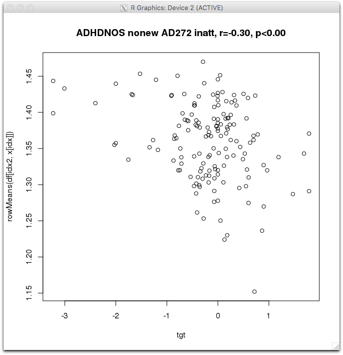
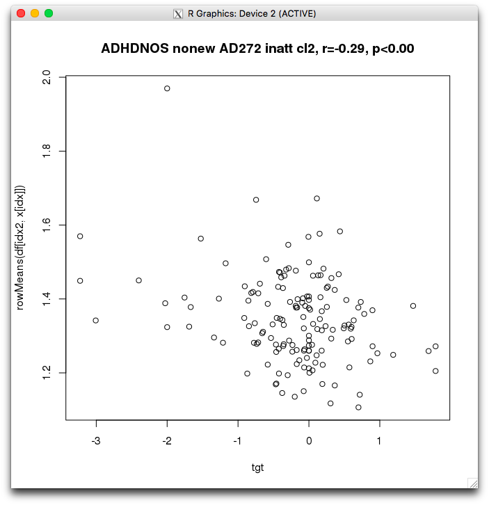


It's hard to say if those are truly outliers. Out of curiosity, even though the clusters are not as big, let's see how the scatterplots look when including the new_onset cases:


Not much difference. Might as well stick with nonew for now.

```bash
3dclust -NN1 1 -orient LPI -savemask mycluster.nii -overwrite /data/NCR_SBRB/tmp/dti_ad_voxelwise_n272_09212018/ADHDNOS_nonew_OLS_inatt_slope_winsorize_None_42+orig
3dcalc -a mycluster.nii -prefix myres.nii -overwrite -expr "amongst(a, 1)"
flirt -in myres.nii -ref /usr/local/apps/fsl/6.0.0/data/standard/MNI152_T1_1mm.nii.gz -out myres_inMNI152.nii.gz -applyxfm -init ~/data/aging_to_MNI152.mat -interp nearestneighbour
# just to get the COM for labeling
3dclust -NN1 1 -orient LPI myres_inMNI152.nii.gz
```

inattention (AD):


HI (RD):
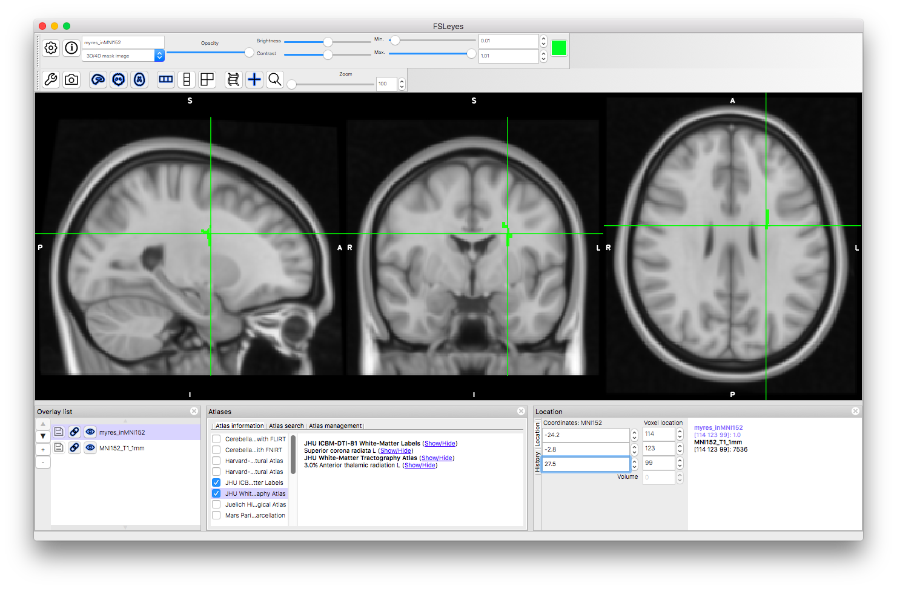


## struct

We'll focus on volume, which has the most results and combine area and thickness. For convenience, these are the nonew results:

```
struct_volume_11142018_260timeDiff12mo (RH): ADHDNOS_nonew_OLS_HI_slope_winsorize_None (250 perms)
struct_volume_11142018_260timeDiff12mo (LH): ADHDNOS_nonew_OLS_inatt_slope_winsorize_None (250 perms)
struct_volume_11142018_260timeDiff12mo (RH): ADHDNOS_nonew_OLS_inatt_slope_winsorize_None (250 perms)
```

```bash
awk 'NR>=13 && NR<2575' /data/NCR_SBRB/tmp/struct_volume_11142018_260timeDiff12mo/ADHDNOS_nonew_OLS_HI_slope_winsorize_None_42_rh_ClstMsk_e1_a1.0.niml.dset > ~/tmp/clusters.txt
```

```r
winsorize = function(x, cut = 0.01){
  cut_point_top <- quantile(x, 1 - cut, na.rm = T)
  cut_point_bottom <- quantile(x, cut, na.rm = T)
  i = which(x >= cut_point_top) 
  x[i] = cut_point_top
  j = which(x <= cut_point_bottom) 
  x[j] = cut_point_bottom
  return(x)
}
clin = read.csv('/data/NCR_SBRB/baseline_prediction/long_clin_11302018.csv')
load('/data/NCR_SBRB/baseline_prediction/struct_volume_11142018_260timeDiff12mo.RData.gz')
df = merge(clin, data, by='MRN')
x = colnames(df)[grepl(pattern = '^v_rh', colnames(df))]
a = read.table('~/tmp/clusters.txt')[,1]
idx = which(a==1)
idx2 = df$diag_group != 'new_onset' & df$DX != 'NV'
tgt = winsorize(df[idx2,]$OLS_HI_slope)
plot(tgt, rowMeans(df[idx2, x[idx]]))
b = cor.test(tgt, rowMeans(df[idx2, x[idx]]))
title(sprintf('ADHDNOS nonew volume RH HI, r=%.2f, p<%.2f', b$estimate, b$p.value))
```

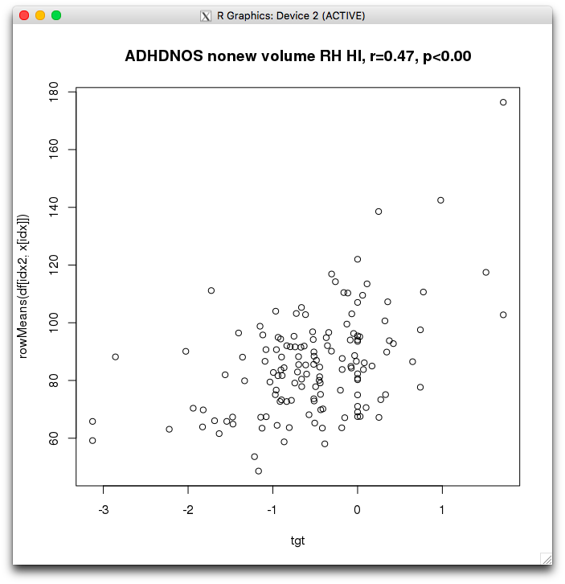
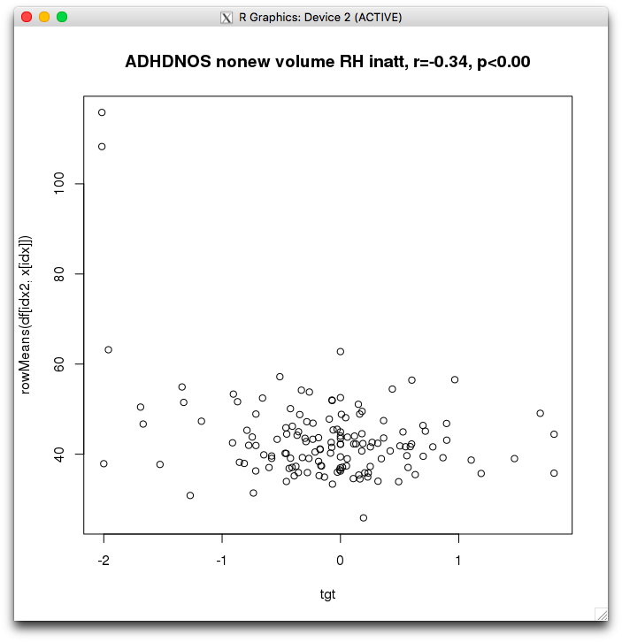

This second one is clearly moved by outliers...

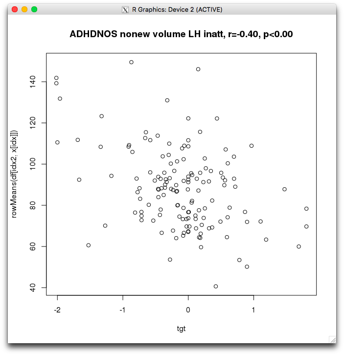

```bash
awk 'NR>=13 && NR<2575' ~/tmp/struct_volume_11142018_260timeDiff12mo/ADHDNOS_nonew_OLS_HI_slope_winsorize_None_42_rh_ClstMsk_e1_a1.0.niml.dset > ~/tmp/clusters.txt
# single out the one region
awk '{ if ($1 != 1 ) print 0; else print 1 }' ~/tmp/clusters.txt > rh_HI.txt
awk 'NR>=13 && NR<2575' ~/tmp/struct_volume_11142018_260timeDiff12mo/ADHDNOS_nonew_OLS_inatt_slope_winsorize_None_42_lh_ClstMsk_e1_a1.0.niml.dset > ~/tmp/clusters.txt
awk '{ if ($1 != 1 ) print 0; else print 1 }' ~/tmp/clusters.txt > lh_inatt.txt
suma -i_fs /Volumes/Shaw/freesurfer5.3_subjects/fsaverage4/SUMA/lh.pial.asc
```


# 2018-12-13 13:11:17

Let's run some crappy domain descriptives.

```bash
mydir=~/data/baseline_prediction/;
for f in cog_all_09242018.RData.gz geno3_prs_09192018.RData.gz \
    social_09262018.RData.gz clinics_binary_sx_baseline_10022018.RData.gz \
    adhd200_10042018.RData.gz; do
    for target in OLS_inatt_slope OLS_HI_slope; do
        echo ==== $f $target ====;
        Rscript --vanilla ~/research_code/baseline_prediction/descriptives/generic.R ${mydir}/${f} ${mydir}/long_clin_11302018.csv ADHDNOS_nonew_${target} 42 winsorize_None;
    done;
done
```

Note that I'm only running that for the nonew subset, conforming to the previous
results. I used script to output the results, and here are the main findings:

```
==== cog_all_09242018.RData.gz OLS_HI_slope ====
[1] "Variables at p<.05: 2 / 25"
[1] "v_Raw_SS_total" "v_Raw_SSB"
==== geno3_prs_09192018.RData.gz OLS_inatt_slope ====
[1] "Variables at p<.05: 2 / 13"
[1] "v_PROFILES.0.0001.profile" "v_PROFILES.0.0005.profile"
==== geno3_prs_09192018.RData.gz OLS_HI_slope ====
[1] "Variables at p<.05: 1 / 13"
[1] "v_PROFILES.0.00001.profile"
==== social_09262018.RData.gz OLS_HI_slope ====
[1] "Variables at p<.05: 1 / 18"
[1] "v_Priv_School"
==== clinics_binary_sx_baseline_10022018.RData.gz OLS_inatt_slope ====
[1] "Variables at p<.05: 8 / 8"
[1] "v_SX_inatt"          "v_SX_HI"             "vCateg_diff.organ"  
[4] "vCateg_avoids"       "vCateg_loses"        "vCateg_easily.distr"
[7] "vCateg_forgetful"    "vCateg_waiting.turn"
==== clinics_binary_sx_baseline_10022018.RData.gz OLS_HI_slope ====
[1] "Variables at p<.05: 3 / 11"
[1] "v_SX_HI"             "vCateg_fidgety"      "vCateg_waiting.turn"
[1] "Variables at q<.05: 2 / 11"
[1] "v_SX_HI"             "vCateg_waiting.turn"
==== adhd200_10042018.RData.gz OLS_inatt_slope ====
[1] "Variables at p<.05: 1 / 3"
[1] "v_Age"
[1] "Variables at q<.05: 1 / 3"
[1] "v_Age"
```

I decided to report only the nominal p-values because I didn't want to restrict
the number of variables we're using for FDR or Meff. If they're crappy in the
end, the ML algorithm will likely throw it away. The results not listed did not
have any nominal results. Also, I think we could probably get rid of the
socioeconomic variables for now.

The baseline SX results are interesting, especially the individual binary
symptoms. The baseline SX makes sense, as one cannot have negative OLS at zero,
not positive at 9, so that makes the distribution somewhat diagonal, creating a
correlation. One could also argue that the more symptoms at baseline, the more
one has to lose, so there's your correlation.


Now, it's a matter of putting those variables together in a model, to combine
with the neural cluster averages.

# 2018-12-14 09:37:15

##melodic

```bash
myfile=melodic_NOSdescriptives.txt
rm $myfile; touch $myfile;
for f in `/bin/ls \
    /data/NCR_SBRB/tmp/melodic_*IC*/ADHDNOS*_42_clusters.txt`; do
    echo $f >> $myfile;
    grep -v \# $f | head -n 5 >> $myfile;
done
```

```bash
/bin/ls -1 /data/NCR_SBRB/tmp/melodic_*_IC*/ADHDNOS*_42_clusters.txt > result_files.txt;
for root_file in `cat result_files.txt | sed -e 's/_42_clusters.txt//g'`; do
    collect_name=${root_file}_top_rnd_clusters.txt;
    echo $collect_name;
    if [ -e $collect_name ]; then
        rm $collect_name;
    fi;
    for f in `ls ${root_file}*rnd*clusters.txt`; do
        grep -v \# $f | head -n 1 >> $collect_name;
    done
done
tar -zcvf melodic_ADHDNOS_top_rnd_clusters.tar.gz melodic_*_IC*/ADHDNOS*top_rnd_clusters.txt
```

```r
res_fname = '~/tmp/melodic_NOSdescriptives.txt'
out_file = '~/tmp/pvals_NOSmelodic.txt'
res_lines = readLines(res_fname)
for (line in res_lines) {
  # starting new file summary
  if (grepl(pattern='clusters', line)) {
    root_fname = strsplit(line, '/')[[1]]
    dir_name = root_fname[length(root_fname)-1]
    root_fname = strsplit(root_fname[length(root_fname)], '_')[[1]]
    root_fname = paste0(root_fname[1:(length(root_fname)-2)], sep='', collapse='_')
    rnd_fname = sprintf('~/tmp/%s/%s_top_rnd_clusters.txt', dir_name, root_fname)
    if (file.exists(rnd_fname)) {
        rnd_results = read.table(rnd_fname)[, 1]
        nperms = length(rnd_results)
    } else {
        rnd_results = NA
        nperms = NA
    }
    cat(sprintf('%s: %s (%d perms)\n', dir_name, root_fname, nperms),
        file=out_file, append=T)
  } 
  else {
    parsed = strsplit(line, ' +')
    clus_size = as.numeric(parsed[[1]][2])
    pval = sum(rnd_results >= clus_size) / nperms
    cat(sprintf('Cluster size: %d, p<%.3f', clus_size, pval),
        file=out_file, append=T)
    if (!is.na(pval) && pval < .05) {
      cat(' *', file=out_file, append=T)
    }
    if (!is.na(pval) && pval < .01) {
      cat('*', file=out_file, append=T)
    }
    cat('\n', file=out_file, append=T)
  }
}
```

Overall, every time there was a subjScale and None results, the subjScale
clusters were bigger, but the actual p-value for None was smaller. So, let's
focus on those for now. 

But there might be something odd here, as all results are either
ADHDNOS_nonew_OLS_HI with 40 voxels, or ADHDNOS_OLS_inatt for 56 voxels. Across
all 7 ICs in fancy, but nothing in inter.


```bash
hg-02127244-lw0:tmp sudregp$ grep -B 1 "*" pvals_NOSmelodic.txt
dti_ad_voxelwise_n272_09212018: ADHDNOS_nonew_OLS_inatt_slope_winsorize_None (248 perms)
Cluster size: 41, p<0.012 *
Cluster size: 31, p<0.044 *
--
dti_ad_voxelwise_n272_09212018: ADHDNOS_OLS_inatt_slope_winsorize_None (250 perms)
Cluster size: 38, p<0.036 *
--
dti_rd_voxelwise_n272_09212018: ADHDNOS_nonew_OLS_HI_slope_winsorize_None (249 perms)
Cluster size: 92, p<0.004 **
--
dti_rd_voxelwise_n272_09212018: ADHDNOS_OLS_HI_slope_winsorize_None (249 perms)
Cluster size: 87, p<0.012 *
```

It looks like the nonew results are stronger. Let's start doing scatterplots of those results then, both in structural and DTI results, while we wait for MELODIC.

```bash
3dclust -NN1 1 -orient LPI -savemask mycluster.nii /data/NCR_SBRB/tmp/dti_ad_voxelwise_n272_09212018/ADHDNOS_nonew_OLS_inatt_slope_winsorize_None_42+orig
3dmaskdump -mask /data/NCR_SBRB/baseline_prediction/mean_272_fa_skeleton_mask.nii.gz mycluster.nii > out.txt
```

```r
winsorize = function(x, cut = 0.01){
  cut_point_top <- quantile(x, 1 - cut, na.rm = T)
  cut_point_bottom <- quantile(x, cut, na.rm = T)
  i = which(x >= cut_point_top) 
  x[i] = cut_point_top
  j = which(x <= cut_point_bottom) 
  x[j] = cut_point_bottom
  return(x)
}
load('/data/NCR_SBRB/baseline_prediction/dti_ad_voxelwise_n272_09212018.RData.gz')
a = read.table('~/tmp/out.txt')[,4]
idx = which(a==1)
clin = read.csv('/data/NCR_SBRB/baseline_prediction/long_clin_11302018.csv')
df = merge(clin, data, by='MRN')
x = colnames(df)[grepl(pattern = '^v', colnames(df))]
idx2 = df$diag_group != 'new_onset' & df$DX != 'NV'
tgt = winsorize(df[idx2,]$OLS_inatt_slope)
plot(tgt, rowMeans(df[idx2, x[idx]]))
b = cor.test(tgt, rowMeans(df[idx2, x[idx]]))
title(sprintf('ADHDNOS nonew AD272 inatt, r=%.2f, p<%.2f', b$estimate, b$p.value))
```

# 2018-12-17 15:14:56

##melodic

```bash
myfile=melodic_NOSdescriptives.txt
rm $myfile; touch $myfile;
for f in `/bin/ls \
    /data/NCR_SBRB/tmp/melodic_*_IC*12142018/ADHDNOS*_42_clusters.txt`; do
    echo $f >> $myfile;
    grep -v \# $f | head -n 5 >> $myfile;
done
```

```bash
/bin/ls -1 /data/NCR_SBRB/tmp/melodic_*_IC*_12142018/ADHDNOS*_42_clusters.txt > result_files.txt;
for root_file in `cat result_files.txt | sed -e 's/_42_clusters.txt//g'`; do
    collect_name=${root_file}_top_rnd_clusters.txt;
    echo $collect_name;
    if [ -e $collect_name ]; then
        rm $collect_name;
    fi;
    for f in `ls ${root_file}*rnd*clusters.txt`; do
        grep -v \# $f | head -n 1 >> $collect_name;
    done
done
tar -zcvf melodic_ADHDNOS_top_rnd_clusters.tar.gz melodic_*_IC*_12142018/ADHDNOS*top_rnd_clusters.txt
```

```r
res_fname = '~/tmp/melodic_NOSdescriptives.txt'
out_file = '~/tmp/pvals_NOSmelodic.txt'
res_lines = readLines(res_fname)
for (line in res_lines) {
  # starting new file summary
  if (grepl(pattern='clusters', line)) {
    root_fname = strsplit(line, '/')[[1]]
    dir_name = root_fname[length(root_fname)-1]
    root_fname = strsplit(root_fname[length(root_fname)], '_')[[1]]
    root_fname = paste0(root_fname[1:(length(root_fname)-2)], sep='', collapse='_')
    rnd_fname = sprintf('~/tmp/%s/%s_top_rnd_clusters.txt', dir_name, root_fname)
    if (file.exists(rnd_fname)) {
        rnd_results = read.table(rnd_fname)[, 1]
        nperms = length(rnd_results)
    } else {
        rnd_results = NA
        nperms = NA
    }
    cat(sprintf('%s: %s (%d perms)\n', dir_name, root_fname, nperms),
        file=out_file, append=T)
  } 
  else {
    parsed = strsplit(line, ' +')
    clus_size = as.numeric(parsed[[1]][2])
    pval = sum(rnd_results >= clus_size) / nperms
    cat(sprintf('Cluster size: %d, p<%.3f', clus_size, pval),
        file=out_file, append=T)
    if (!is.na(pval) && pval < .05) {
      cat(' *', file=out_file, append=T)
    }
    if (!is.na(pval) && pval < .01) {
      cat('*', file=out_file, append=T)
    }
    cat('\n', file=out_file, append=T)
  }
}
```

For melodic our results using subjScale were actually better. 

```bash
hg-02127244-lw0:tmp sudregp$ grep -B 1 "*" pvals_NOSmelodic.txt | grep nonew
melodic_fancy_IC37_12142018: ADHDNOS_nonew_OLS_inatt_slope_winsorize_subjScale (249 perms)
melodic_fancy_IC57_12142018: ADHDNOS_nonew_OLS_HI_slope_winsorize_None (250 perms)
melodic_inter_IC11_12142018: ADHDNOS_nonew_OLS_inatt_slope_winsorize_subjScale (249 perms)
melodic_inter_IC2_12142018: ADHDNOS_nonew_OLS_inatt_slope_winsorize_subjScale (248 perms)
melodic_inter_IC31_12142018: ADHDNOS_nonew_OLS_inatt_slope_winsorize_subjScale (250 perms)
```

Those networks are VAN, limbic, and DMN. Let's make the usual scatterplots.

```bash
3dclust -NN1 1 -orient LPI -savemask mycluster.nii -overwrite /data/NCR_SBRB/tmp/melodic_inter_IC31_12142018/ADHDNOS_nonew_OLS_inatt_slope_winsorize_subjScale_42+tlrc
3dmaskdump -mask ~/data/baseline_prediction/same_space/epi/group_epi_mask_inter.nii mycluster.nii > out.txt
```

```r
winsorize = function(x, cut = 0.01){
  cut_point_top <- quantile(x, 1 - cut, na.rm = T)
  cut_point_bottom <- quantile(x, cut, na.rm = T)
  i = which(x >= cut_point_top) 
  x[i] = cut_point_top
  j = which(x <= cut_point_bottom) 
  x[j] = cut_point_bottom
  return(x)
}
load('/data/NCR_SBRB/baseline_prediction/melodic_inter_IC31_12142018.RData.gz')
a = read.table('~/tmp/out.txt')[,4]
idx = which(a==1)
clin = read.csv('/data/NCR_SBRB/baseline_prediction/long_clin_11302018.csv')
df = merge(clin, data, by='MRN')
x = colnames(df)[grepl(pattern = '^v', colnames(df))]
idx2 = df$diag_group != 'new_onset' & df$DX != 'NV'
tgt = winsorize(df[idx2,]$OLS_inatt_slope)
plot(tgt, rowMeans(df[idx2, x[idx]]))
b = cor.test(tgt, rowMeans(df[idx2, x[idx]]))
title(sprintf('ADHDNOS inter IC 31 limbic inatt, r=%.2f, p<%.2f', b$estimate, b$p.value))
```


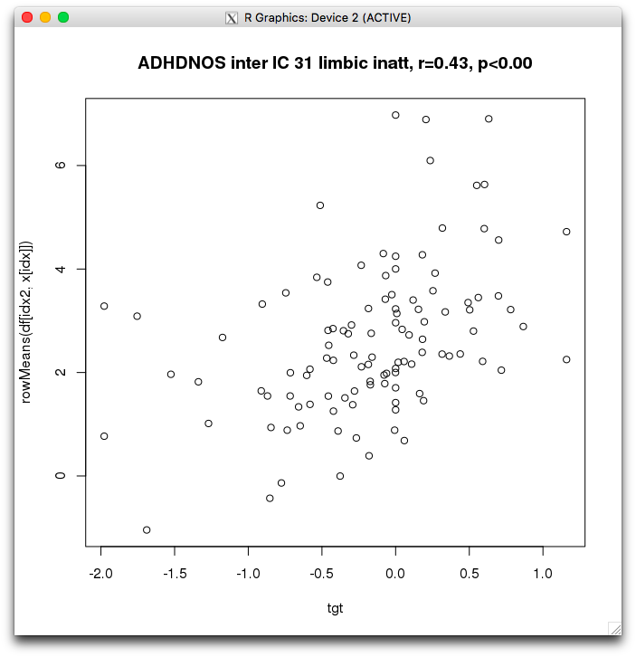

And we should probably check out where in the brain they are, before setting them up for classification. I'm not going to make the 95 percentile masks we used in the paper for now, but we can have an idea of where the cluster is base don the pictures, and then compare to the actual networks in the Yeo paper to see if they make sense.

```bash
3dclust -NN1 1 -orient LPI -savemask mycluster.nii -overwrite /data/NCR_SBRB/tmp/melodic_inter_IC31_12142018/ADHDNOS_nonew_OLS_inatt_slope_winsorize_subjScale_42+tlrc
3dcalc -a mycluster.nii -prefix res31.nii -overwrite -expr "amongst(a, 1)"
3dclust -NN1 1 -orient LPI -savemask mycluster.nii -overwrite /data/NCR_SBRB/tmp/melodic_inter_IC2_12142018/ADHDNOS_nonew_OLS_inatt_slope_winsorize_subjScale_42+tlrc
3dcalc -a mycluster.nii -prefix res2.nii -overwrite -expr "amongst(a, 1)"
3dclust -NN1 1 -orient LPI -savemask mycluster.nii -overwrite /data/NCR_SBRB/tmp/melodic_inter_IC11_12142018/ADHDNOS_nonew_OLS_inatt_slope_winsorize_subjScale_42+tlrc
3dcalc -a mycluster.nii -prefix res11.nii -overwrite -expr "amongst(a, 1)"
```

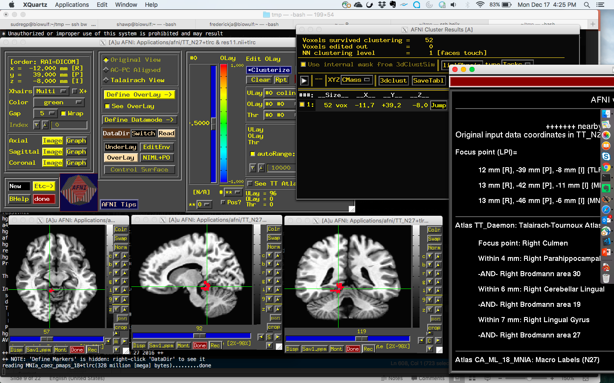
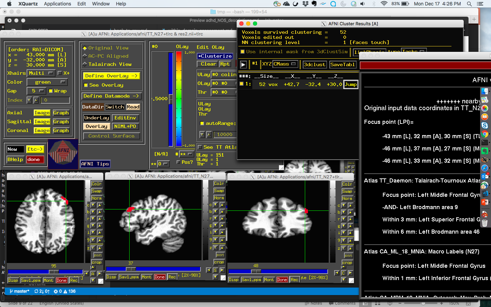


We got a couple hard hits there. For DMN (IC2), we got LMFG, which is neat. But limbic (IC31) we got left ACC, quite inferior, and VAN (IC11) we got cerebellum. We coudl restrict it to DMN, so we'll see.

# 2018-12-19 14:39:43

Philip asked me to re-run the results, but this time keeping the new_onset folks
and also plotting NVs in the scatterplots. Let's do it

## DTI

```bash
sudregp@HG-02070684-DM2:~/tmp$ grep -B 1 "*" pvals_NOSdti.txt | grep S_O -A 1
dti_ad_voxelwise_n272_09212018: ADHDNOS_OLS_inatt_slope_winsorize_None (250 perms)
dti_rd_voxelwise_n272_09212018: ADHDNOS_OLS_HI_slope_winsorize_None (249 perms)
```

```bash
3dclust -NN1 1 -orient LPI -savemask mycluster.nii -overwrite /data/NCR_SBRB/tmp/dti_ad_voxelwise_n272_09212018/ADHDNOS_OLS_inatt_slope_winsorize_None_42+orig
3dmaskdump -mask /data/NCR_SBRB/baseline_prediction/mean_272_fa_skeleton_mask.nii.gz mycluster.nii > out_AD_inatt.txt
3dclust -NN1 1 -orient LPI -savemask mycluster.nii -overwrite /data/NCR_SBRB/tmp/dti_rd_voxelwise_n272_09212018/ADHDNOS_OLS_HI_slope_winsorize_None_42+orig
3dmaskdump -mask /data/NCR_SBRB/baseline_prediction/mean_272_fa_skeleton_mask.nii.gz mycluster.nii > out_RD_HI.txt
```

```r
winsorize = function(x, cut = 0.01){
  cut_point_top <- quantile(x, 1 - cut, na.rm = T)
  cut_point_bottom <- quantile(x, cut, na.rm = T)
  i = which(x >= cut_point_top) 
  x[i] = cut_point_top
  j = which(x <= cut_point_bottom) 
  x[j] = cut_point_bottom
  return(x)
}
clin = read.csv('/data/NCR_SBRB/baseline_prediction/long_clin_11302018.csv')
load('/data/NCR_SBRB/baseline_prediction/dti_ad_voxelwise_n272_09212018.RData.gz')
a = read.table('~/tmp/out_AD_inatt.txt')[,4]
idx = which(a==1)
df = merge(clin, data, by='MRN')
x = colnames(df)[grepl(pattern = '^v', colnames(df))]
idx2 = df$DX != 'NV'
tgt = winsorize(df[idx2,]$OLS_inatt_slope)
par(mfrow=c(1,2))
plot(tgt, rowMeans(df[idx2, x[idx]]))
b = cor.test(tgt, rowMeans(df[idx2, x[idx]]))
title(sprintf('ADHDNOS AD272 inatt, r=%.2f, p<%.2f', b$estimate, b$p.value))
plot(tgt, rowMeans(df[idx2, x[idx]]))
idx3 = df$DX == 'NV'
points(df[idx3,]$OLS_inatt_slope, rowMeans(df[idx3, x[idx]]), pch=2)
title('adding NVs as triangles')

dev.new()
load('/data/NCR_SBRB/baseline_prediction/dti_rd_voxelwise_n272_09212018.RData.gz')
a = read.table('~/tmp/out_RD_HI.txt')[,4]
idx = which(a==1)
df = merge(clin, data, by='MRN')
x = colnames(df)[grepl(pattern = '^v', colnames(df))]
idx2 = df$DX != 'NV'
tgt = winsorize(df[idx2,]$OLS_HI_slope)
par(mfrow=c(1,2))
plot(tgt, rowMeans(df[idx2, x[idx]]))
b = cor.test(tgt, rowMeans(df[idx2, x[idx]]))
title(sprintf('ADHDNOS RD272 HI, r=%.2f, p<%.2f', b$estimate, b$p.value))
plot(tgt, rowMeans(df[idx2, x[idx]]))
idx3 = df$DX == 'NV'
points(df[idx3,]$OLS_HI_slope, rowMeans(df[idx3, x[idx]]), pch=2)
title('adding NVs as triangles')
```


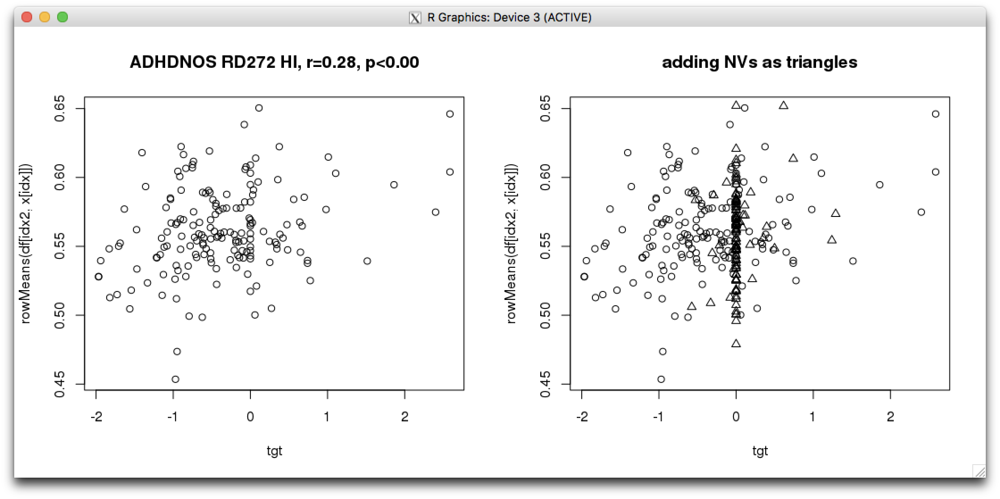

```bash
3dclust -NN1 1 -orient LPI -savemask mycluster.nii -overwrite /data/NCR_SBRB/tmp/dti_ad_voxelwise_n272_09212018/ADHDNOS_OLS_inatt_slope_winsorize_None_42+orig
3dcalc -a mycluster.nii -prefix myres.nii -overwrite -expr "amongst(a, 1)"
flirt -in myres.nii -ref /usr/local/apps/fsl/6.0.0/data/standard/MNI152_T1_1mm.nii.gz -out ad_inatt_inMNI152.nii.gz -applyxfm -init ~/data/aging_to_MNI152.mat -interp nearestneighbour
3dclust -NN1 1 -orient LPI -savemask mycluster.nii -overwrite /data/NCR_SBRB/tmp/dti_rd_voxelwise_n272_09212018/ADHDNOS_OLS_HI_slope_winsorize_None_42+orig
3dcalc -a mycluster.nii -prefix myres.nii -overwrite -expr "amongst(a, 1)"
flirt -in myres.nii -ref /usr/local/apps/fsl/6.0.0/data/standard/MNI152_T1_1mm.nii.gz -out rd_HI_inMNI152.nii.gz -applyxfm -init ~/data/aging_to_MNI152.mat -interp nearestneighbour

# just to get the COM for labeling
3dclust -NN1 1 -orient LPI ad_inatt_inMNI152.nii.gz
3dclust -NN1 1 -orient LPI rd_HI_inMNI152.nii.gz
```

inattention (AD):
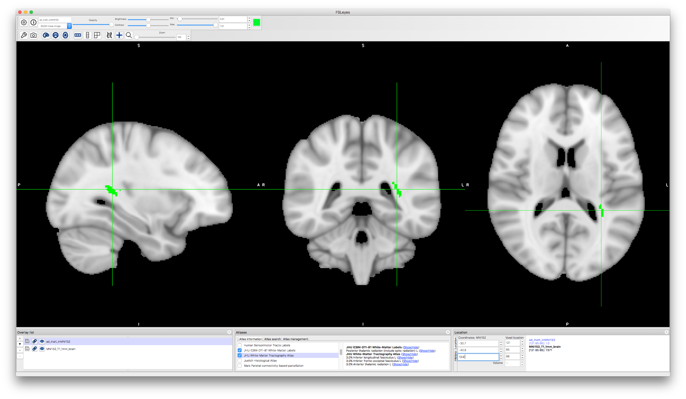

HI (RD):


## structural

```bash
sudregp@HG-02070684-DM2:~/tmp$ grep -B 1 "*" pvals_NOSstruct.txt | grep S_O | grep None
struct_area_11142018_260timeDiff12mo (LH): ADHDNOS_OLS_inatt_slope_winsorize_None (248 perms)
struct_thickness_11142018_260timeDiff12mo (LH): ADHDNOS_OLS_inatt_slope_winsorize_None (249 perms)
struct_volume_11142018_260timeDiff12mo (RH): ADHDNOS_OLS_HI_slope_winsorize_None (249 perms)
struct_volume_11142018_260timeDiff12mo (LH): ADHDNOS_OLS_inatt_slope_winsorize_None (248 perms)
struct_volume_11142018_260timeDiff12mo (RH): ADHDNOS_OLS_inatt_slope_winsorize_None (248 perms)
```

The None results were stronger overall. Like before, we focus on volume. So, we
do:

```bash
awk 'NR>=13 && NR<2575' /data/NCR_SBRB/tmp/struct_volume_11142018_260timeDiff12mo/ADHDNOS_OLS_HI_slope_winsorize_None_42_rh_ClstMsk_e1_a1.0.niml.dset > vol_HI_rh.txt
awk 'NR>=13 && NR<2575' /data/NCR_SBRB/tmp/struct_volume_11142018_260timeDiff12mo/ADHDNOS_OLS_inatt_slope_winsorize_None_42_lh_ClstMsk_e1_a1.0.niml.dset > vol_inatt_lh.txt
awk 'NR>=13 && NR<2575' /data/NCR_SBRB/tmp/struct_volume_11142018_260timeDiff12mo/ADHDNOS_OLS_inatt_slope_winsorize_None_42_rh_ClstMsk_e1_a1.0.niml.dset > vol_inatt_rh.txt
```

```r
winsorize = function(x, cut = 0.01){
  cut_point_top <- quantile(x, 1 - cut, na.rm = T)
  cut_point_bottom <- quantile(x, cut, na.rm = T)
  i = which(x >= cut_point_top) 
  x[i] = cut_point_top
  j = which(x <= cut_point_bottom) 
  x[j] = cut_point_bottom
  return(x)
}
clin = read.csv('/data/NCR_SBRB/baseline_prediction/long_clin_11302018.csv')
load('/data/NCR_SBRB/baseline_prediction/struct_volume_11142018_260timeDiff12mo.RData.gz')
df = merge(clin, data, by='MRN')
x = colnames(df)[grepl(pattern = '^v_rh', colnames(df))]
a = read.table('~/tmp/vol_HI_rh.txt')[,1]
idx = which(a==1)
idx2 = df$DX != 'NV'
tgt = winsorize(df[idx2,]$OLS_HI_slope)
par(mfrow=c(1,2))
plot(tgt, rowMeans(df[idx2, x[idx]]))
b = cor.test(tgt, rowMeans(df[idx2, x[idx]]))
title(sprintf('volume RH HI, r=%.2f, p<%.2f', b$estimate, b$p.value))
plot(tgt, rowMeans(df[idx2, x[idx]]))
idx3 = df$DX == 'NV'
points(df[idx3,]$OLS_HI_slope, rowMeans(df[idx3, x[idx]]), pch=2)
title('adding NVs as triangles')
dev.new()
x = colnames(df)[grepl(pattern = '^v_lh', colnames(df))]
a = read.table('~/tmp/vol_inatt_lh.txt')[,1]
idx = which(a==1)
idx2 = df$DX != 'NV'
tgt = winsorize(df[idx2,]$OLS_inatt_slope)
par(mfrow=c(2,2))
plot(tgt, rowMeans(df[idx2, x[idx]]))
b = cor.test(tgt, rowMeans(df[idx2, x[idx]]))
title(sprintf('volume LH inatt, r=%.2f, p<%.2f', b$estimate, b$p.value))
plot(tgt, rowMeans(df[idx2, x[idx]]))
idx3 = df$DX == 'NV'
points(df[idx3,]$OLS_inatt_slope, rowMeans(df[idx3, x[idx]]), pch=2)
title('adding NVs as triangles')
x = colnames(df)[grepl(pattern = '^v_rh', colnames(df))]
a = read.table('~/tmp/vol_inatt_rh.txt')[,1]
idx = which(a==1)
plot(tgt, rowMeans(df[idx2, x[idx]]))
b = cor.test(tgt, rowMeans(df[idx2, x[idx]]))
title(sprintf('volume RH inatt, r=%.2f, p<%.2f', b$estimate, b$p.value))
plot(tgt, rowMeans(df[idx2, x[idx]]))
idx3 = df$DX == 'NV'
points(df[idx3,]$OLS_inatt_slope, rowMeans(df[idx3, x[idx]]), pch=2)
title('adding NVs as triangles')
```


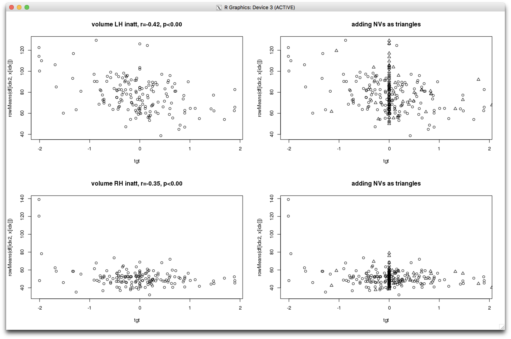

The RH inatt result is clearly driven by outliers, so let's not go through with it.

```bash
awk '{ if ($1 != 1 ) print 0; else print 1 }' ~/tmp/vol_HI_rh.txt > rh_HI.txt
awk '{ if ($1 != 1 ) print 0; else print 1 }' ~/tmp/vol_inatt_lh.txt > lh_inatt.txt
suma -i_fs /Volumes/Shaw/freesurfer5.3_subjects/fsaverage4/SUMA/lh.pial.asc
```

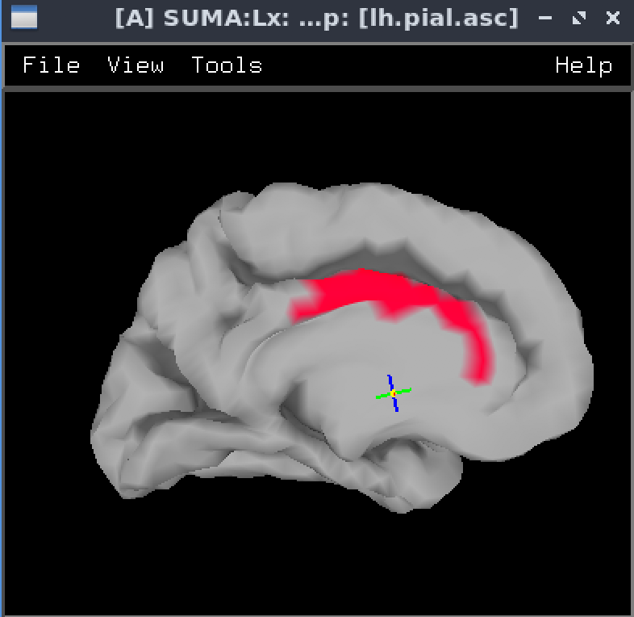

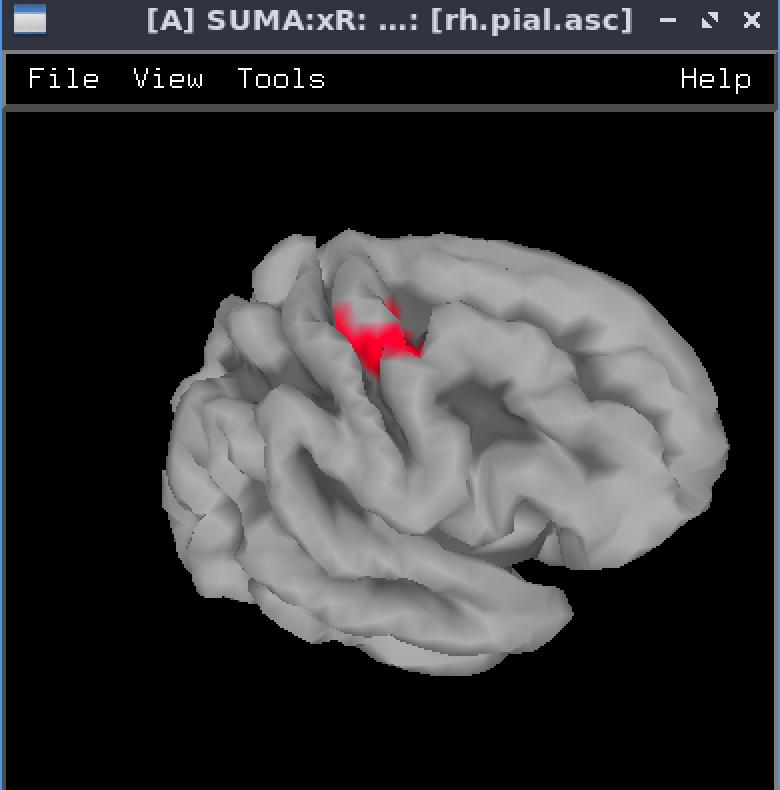


## MELODIC

```bash
sudregp@HG-02070684-DM2:~/tmp$ grep -B 1 "*" pvals_NOSmelodic.txt | grep 1214 | grep S_O | grep subjS
melodic_fancy_IC24_12142018: ADHDNOS_OLS_inatt_slope_winsorize_subjScale (250 perms)
melodic_fancy_IC37_12142018: ADHDNOS_OLS_inatt_slope_winsorize_subjScale (248 perms)
melodic_fancy_IC54_12142018: ADHDNOS_OLS_inatt_slope_winsorize_subjScale (250 perms)
melodic_inter_IC31_12142018: ADHDNOS_OLS_inatt_slope_winsorize_subjScale (250 perms)
```

The subjScale results were stronger overall. Now I'm getting 3 networks with the
fancy mask: 24 (somatomotor), 37 (visual), and 54 (limbic). Not great... The
None results also didn't have any DMN in it. The only way to get it is excluding
new_onset...


# TODO
 * plot resting state/melodic results even though they're in crappy networks?