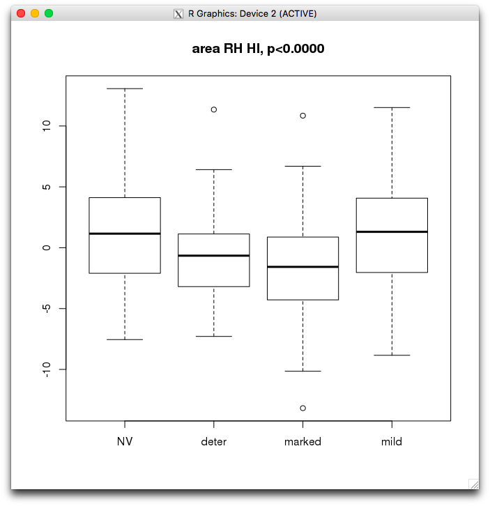
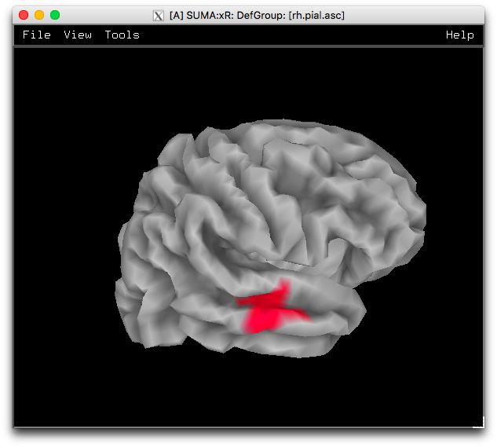
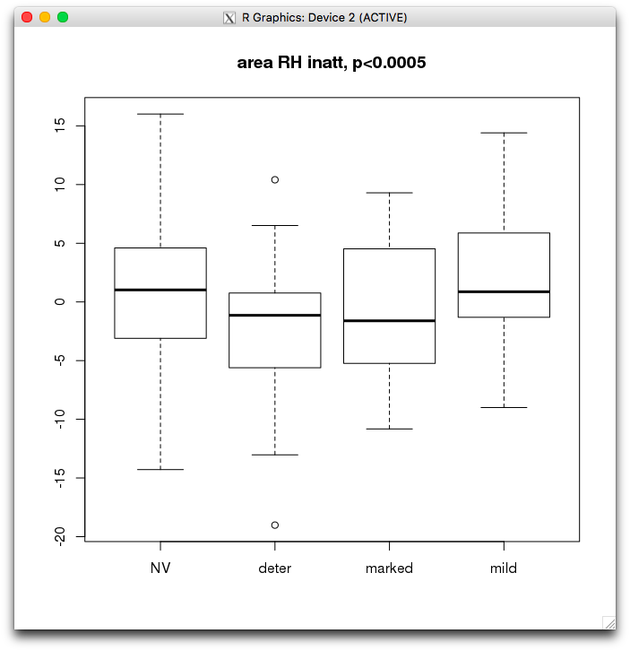
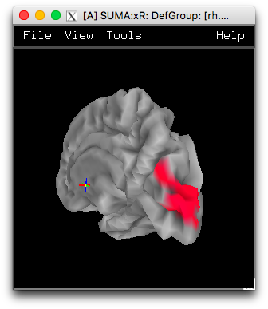

# 2019-01-25 15:21:06

Another approach I can try is to do the ANOVAs after residualizing the brain.
The variables to use in the residuals can be chosen in a stepwise regression.
Again, let's look at the structural results first because they run faster.

I have no idea how long they'll take to run, so before I run the randomizations
I want to check how the biggest clusters look like. I did 50 voxels in my
desktop in 2 minutes. So, all 5049 in the structural dataset should take about
3.5h.

```bash
job_name=residANOVAstruct;
mydir=/data/NCR_SBRB/baseline_prediction/;
swarm_file=swarm.desc_${job_name};
rm -rf $swarm_file;
for f in `/bin/ls struct_*_11142018_260timeDiff12mo.RData.gz`; do
    for pp in None subjScale; do
        for target in OLS_inatt_categ OLS_HI_categ; do
            echo "Rscript --vanilla ~/research_code/baseline_prediction/descriptives/structural_resids_anova.R ${mydir}/${f} ${mydir}/long_clin_11302018.csv ${target} 42 $pp" >> $swarm_file;
        done;
    done;
done
swarm -f $swarm_file -g 4 -t 2 --time 4:00:00 --partition quick --logdir trash_desc_${job_name} --job-name ${job_name} -m R,afni --gres=lscratch:2
```

For DTI it's taking less than 1min for 50 voxels, and we have 12K. So, this
should be about 4h as well. But that didn't work, so I had to increase it to 8h
just to be safe.

```bash
job_name=residANOVAdti;
mydir=/data/NCR_SBRB/baseline_prediction/;
swarm_file=swarm.desc_${job_name};
rm -rf $swarm_file;
for f in `/bin/ls dti_??_voxelwise_n2??_09212018.RData.gz`; do
    for pp in None subjScale; do
        for target in OLS_inatt_categ OLS_HI_categ; do
            echo "Rscript --vanilla ~/research_code/baseline_prediction/descriptives/dti_resids_anova.R ${mydir}/${f} ${mydir}/long_clin_11302018.csv ${target} 42 $pp" >> $swarm_file;
        done;
    done;
done
swarm -f $swarm_file -g 4 -t 2 --time 12:00:00 --partition norm --logdir trash_desc_${job_name} --job-name ${job_name} -m R,afni --gres=lscratch:2
```

In rsFMRI I have 44211 voxels in the intersection mask. As I know that took a
long time to begin with, let's not play around.

```bash
job_name=residANOVArsfmri;
mydir=/data/NCR_SBRB/baseline_prediction/;
swarm_file=swarm.desc_${job_name};
rm -rf $swarm_file;
for f in `/bin/ls melodic_fancy_IC*12142018.RData.gz melodic_inter_IC*12142018.RData.gz`; do
    for pp in None subjScale; do
        for target in OLS_inatt_categ OLS_HI_categ; do
            echo "Rscript --vanilla ~/research_code/baseline_prediction/descriptives/melodic_resids_anova.R ${mydir}/${f} ${mydir}/long_clin_11302018.csv ${target} 42 $pp" >> $swarm_file;
        done;
    done;
done
swarm -f $swarm_file -g 4 -t 2 --time 30:00:00 --partition norm --logdir trash_desc_${job_name} --job-name ${job_name} -m R,afni --gres=lscratch:2
```

Just because it's right before the weekend, I should leave the permutations running:

```bash
job_name=residANOVAstructRnd;
mydir=/data/NCR_SBRB/baseline_prediction/;
swarm_file=swarm.desc_${job_name};
rm -rf $swarm_file;
for f in `/bin/ls struct_*_11142018_260timeDiff12mo.RData.gz`; do
    for pp in None subjScale; do
        for target in OLS_inatt_categ OLS_HI_categ; do
            for i in {1..250}; do
                echo "Rscript --vanilla ~/research_code/baseline_prediction/descriptives/structural_resids_anova.R ${mydir}/${f} ${mydir}/long_clin_11302018.csv ${target} -${RANDOM} $pp" >> $swarm_file;
            done;
        done;
    done;
done
split -l 300 $swarm_file ${job_name}_split;
for f in `/bin/ls ${job_name}_split??`; do
    echo "ERROR" > swarm_wait_${USER}
    while grep -q ERROR swarm_wait_${USER}; do
        echo "Trying $f"
        swarm -f $f -g 4 -t 2 --time 8:00:00 --partition quick --logdir trash_desc_${job_name} --job-name ${job_name} -m R,afni --gres=lscratch:2 2> swarm_wait_${USER};
        if grep -q ERROR swarm_wait_${USER}; then
            echo -e "\tError, sleeping..."
            sleep 10m;
        fi;
    done;
done
```

```bash
job_name=residANOVAdtiRnd;
mydir=/data/NCR_SBRB/baseline_prediction/;
swarm_file=swarm.desc_${job_name};
rm -rf $swarm_file;
for f in `/bin/ls dti_??_voxelwise_n2??_09212018.RData.gz`; do
    for pp in None subjScale; do
        for target in OLS_inatt_categ OLS_HI_categ; do
            for i in {1..250}; do
                echo "Rscript --vanilla ~/research_code/baseline_prediction/descriptives/dti_resids_anova.R ${mydir}/${f} ${mydir}/long_clin_11302018.csv ${target} -${RANDOM} $pp" >> $swarm_file;
            done;
        done;
    done;
done
split -l 300 $swarm_file ${job_name}_split;
for f in `/bin/ls ${job_name}_split??`; do
    echo "ERROR" > swarm_wait_${USER}
    while grep -q ERROR swarm_wait_${USER}; do
        echo "Trying $f"
        swarm -f $f -g 4 -t 2 --time 12:00:00 --partition norm --logdir trash_desc_${job_name} --job-name ${job_name} -m R,afni --gres=lscratch:2 2> swarm_wait_${USER};
        if grep -q ERROR swarm_wait_${USER}; then
            echo -e "\tError, sleeping..."
            sleep 10m;
        fi;
    done;
done
```

Running DTI RND as Philip.

```bash
job_name=residANOVArsfmriRnd;
mydir=/data/NCR_SBRB/baseline_prediction/;
swarm_file=swarm.desc_${job_name};
rm -rf $swarm_file;
for f in `/bin/ls melodic_inter_IC*12142018.RData.gz melodic_fancy_IC*12142018.RData.gz`; do
    for pp in None subjScale; do
        for target in OLS_inatt_categ OLS_HI_categ; do
            for i in {1..250}; do
                echo "Rscript --vanilla ~/research_code/baseline_prediction/descriptives/melodic_resids_anova.R ${mydir}/${f} ${mydir}/long_clin_11302018.csv ${target} -${RANDOM} $pp" >> $swarm_file;
            done;
        done;
    done;
done
split -l 600 $swarm_file ${job_name}_split;
for f in `/bin/ls ${job_name}_split??`; do
    echo "ERROR" > swarm_wait_${USER}
    while grep -q ERROR swarm_wait_${USER}; do
        echo "Trying $f"
        swarm -f $f -g 4 -t 2 --time 30:00:00 --partition norm --logdir trash_desc_${job_name} --job-name ${job_name} -m R,afni --gres=lscratch:2 2> swarm_wait_${USER};
        if grep -q ERROR swarm_wait_${USER}; then
            echo -e "\tError, sleeping..."
            sleep 10m;
        fi;
    done;
done
```

Runing some melodic perms in mine and Jens.


PHILIP SUGGESTED I SHOULD TRY NOT USING THE NVS AS THE REFERENCE GROUP. JUST FOR PLOTTING! USE ONE OF THE EXTREME GROUPS TO MAKE RISK RATIO BIGGER

THEN, MAYBE DOING QUADRATIC AND CUBIC FITS WITH ALL 4 GROUPS.

# 2019-02-04 15:49:59

Let's take a look at these results. Just note that I had to kill the rsFMRI
permutations before they were done because I had to run other stuff. Maybe just
run the important ones, after looking at the clustering results?

## structural

```bash
myfile=struct_resids_anova.txt
rm $myfile; touch $myfile;
for f in `/bin/ls /data/NCR_SBRB/tmp/struct_*_11142018_260timeDiff12mo/resids_anova_*42_?h_ClstTable_e1_a1.0.1D`; do
    if ! grep -q 'rnd' $f; then
        # spits out each result and its top 5 clusters
        echo $f >> $myfile;
        grep -v \# $f | head -n 5 >> $myfile;
    fi
done
```

```bash
/bin/ls -1 /data/NCR_SBRB/tmp/struct_*_11142018_260timeDiff12mo/resids_anova_*_42_?h_ClstTable_e1_a1.0.1D | grep -v rnd > result_files.txt;
sed -i -e 's/_42_lh_ClstTable_e1_a1.0.1D//g' result_files.txt;
sed -i -e 's/_42_rh_ClstTable_e1_a1.0.1D//g' result_files.txt;
for root_file in `cat result_files.txt`; do
    collect_name_lh=${root_file}_lh_top_rnd_clusters.txt;
    collect_name_rh=${root_file}_rh_top_rnd_clusters.txt;
    echo $collect_name_lh;
    echo $collect_name_rh;
    if [ -e $collect_name_lh ]; then
        rm $collect_name_lh $collect_name_rh;
    fi;
    for f in `ls ${root_file}_rnd*lh_ClstTable_e1_a1.0.1D`; do
        grep -v \# $f | head -n 1 >> $collect_name_lh;
    done
    for f in `ls ${root_file}_rnd*rh_ClstTable_e1_a1.0.1D`; do
        grep -v \# $f | head -n 1 >> $collect_name_rh;
    done
done
cd /data/NCR_SBRB/tmp
tar -zcvf struct_resids_anova_top_rnd_clusters.tar.gz struct_*_11142018_260timeDiff12mo/resids_anova_*_rnd_clusters.txt
```

Then, bring both the results and the tar.gz files locally for future storage, and:

```r
res_fname = '~/data/baseline_prediction/struct_resids_anova.txt'
out_file = '~/data/baseline_prediction/pvals_struct_resids_anova.txt'
res_lines = readLines(res_fname)
for (line in res_lines) {
  # starting new file summary
  if (grepl(pattern='data', line)) {
    root_fname = strsplit(line, '/')[[1]]
    dir_name = root_fname[length(root_fname)-1]
    root_fname = strsplit(root_fname[length(root_fname)], '_')[[1]]
    root_fname = paste0(root_fname[1:(length(root_fname)-5)], sep='', collapse='_')
    if (grepl(pattern='lh', line)) {
      rnd_fname = sprintf('~/tmp/%s/%s_lh_top_rnd_clusters.txt', dir_name, root_fname)
    } else {
      rnd_fname = sprintf('~/tmp/%s/%s_rh_top_rnd_clusters.txt', dir_name, root_fname)
    }
    if (file.exists(rnd_fname)) {
        rnd_results = read.table(rnd_fname)[, 3]
        nperms = length(rnd_results)
    } else {
        rnd_results = NA
        nperms = NA
    }
    if (grepl(pattern='lh', line)) {
      cat(sprintf('%s (LH): %s (%d perms)\n', dir_name, root_fname, nperms),
          file=out_file, append=T)
    } else {
      cat(sprintf('%s (RH): %s (%d perms)\n', dir_name, root_fname, nperms),
          file=out_file, append=T)
    }
  } 
  else {
    parsed = strsplit(line, ' +')
    clus_size = as.numeric(parsed[[1]][4])
    pval = sum(rnd_results >= clus_size) / nperms
    cat(sprintf('Cluster size: %.2f, p<%.3f', clus_size, pval),
        file=out_file, append=T)
    if ( !is.na(pval) && pval < .05) {
      cat(' *', file=out_file, append=T)
    }
    if ( !is.na(pval) && pval < .01) {
      cat('*', file=out_file, append=T)
    }
    cat('\n', file=out_file, append=T)
  }
}
```

```bash
sudregp@HG-02070684-DM2:~/tmp$ grep -B 1 "*" ~/data/baseline_prediction/pvals_struct_resids_anova.txt
struct_area_11142018_260timeDiff12mo (RH): resids_anova_OLS_HI_categ_None (249 perms)
Cluster size: 992.56, p<0.044 *
--
struct_area_11142018_260timeDiff12mo (RH): resids_anova_OLS_inatt_categ_None (250 perms)
Cluster size: 1226.10, p<0.032 *
--
struct_area_11142018_260timeDiff12mo (RH): resids_anova_OLS_inatt_categ_subjScale (250 perms)
Cluster size: 910.36, p<0.020 *
--
struct_volume_11142018_260timeDiff12mo (RH): resids_anova_OLS_HI_categ_None (248 perms)
Cluster size: 601.92, p<0.016 *
--
struct_volume_11142018_260timeDiff12mo (RH): resids_anova_OLS_HI_categ_subjScale (247 perms)
Cluster size: 485.16, p<0.040 *
```

So, we have a result for area and one for volume. Well, two for area if we
assume it would survive more permutations, and if the location is generally
good.

We do need to plot it to see if it's worth pursuing.

# 2019-02-05 16:35:27

Had to re-run all DTI because Marine brouth up a good point that we should only
combine movement variables after taking their absolute value. Because I don't
want to mess with it, I just won't combine them anymore. Before re-running it
(as Philip), I deleted all the resids_anova* results to avoid further confusion.

Also, a good way to visualize our results would be something like what the
exposome guy did in his paper:

https://www.sciencedirect.com/science/article/pii/S0092867418311218
https://ars.els-cdn.com/content/image/1-s2.0-S0092867418311218-gr4_lrg.jpg

# 2019-02-06 10:31:27

While I wait for the DTI to finish, let's take a closer look at the structural
result.

```bash
awk 'NR>=13 && NR<2575' /data/NCR_SBRB/tmp/struct_volume_11142018_260timeDiff12mo/resids_anova_OLS_HI_categ_None_42_rh_ClstMsk_e1_a1.0.niml.dset > ~/tmp/clusters.txt
```

```r
base_name = '/data/NCR_SBRB'
sx = 'HI'
clin = read.csv(sprintf('%s/baseline_prediction/long_clin_11302018.csv', base_name))
load(sprintf('%s/baseline_prediction/struct_volume_11142018_260timeDiff12mo.RData.gz', base_name))
df = merge(clin, data, by='MRN')
qc = read.csv(sprintf('%s/baseline_prediction/master_qc.csv', base_name))
df = merge(df, qc, by.x='mask.id', by.y='Mask.ID')
library(gdata)
mprage = read.xls(sprintf('%s/baseline_prediction/long_scans_08072018.xlsx', base_name),
                  sheet='mprage')
df = merge(df, mprage, by.x='mask.id', by.y='Mask.ID...Scan')
target = sprintf('OLS_%s_categ', sx)
slope = sprintf('OLS_%s_slope', sx)
df[, target] = NULL
df[df[, slope] <= -.5, target] = 'marked'
df[df[, slope] > -.5 & df[, slope] <= 0, target] = 'mild'
df[df[, slope] > 0, target] = 'deter'
df[df$DX == 'NV', target] = 'NV'
df[, target] = as.factor(df[, target])
df[, target] = relevel(df[, target], ref='NV')
x = colnames(df)[grepl(pattern = '^v_rh', colnames(df))]
a = read.table('~/tmp/clusters.txt')[,1]
idx = which(a==1)
clean_data = c()
library(nlme)
library(MASS)
for (v in x[idx]) {
    print(v)
    mydata = df[, c(target, 'Sex...Subjects', 'ext_avg_freesurfer5.3',
                    'int_avg_freesurfer5.3', 'mprage_QC',
                    'age_at_scan', 'nuclearFamID')]
    mydata$y = df[,v]
    fm = as.formula("y ~ Sex...Subjects + ext_avg_freesurfer5.3 + int_avg_freesurfer5.3 + mprage_QC + age_at_scan + I(age_at_scan^2)")
    fit = try(lme(fm, random=~1|nuclearFamID, data=mydata, na.action=na.omit, method='ML'))
    if (length(fit) > 1) {
        step = try(stepAIC(fit, direction = "both", trace = F))
        if (length(step) > 1) {
            mydata$y = residuals(step)
        } else {
            mydata$y = residuals(fit)
        }
    }
    clean_data = cbind(clean_data, mydata$y)
}
mycluster = rowMeans(clean_data)
fm = as.formula(mycluster ~ df[, target])
fit = aov(lm(fm))
boxplot(fm)
title(sprintf('volume RH HI, p<%.4f', summary(fit)[[1]][1, 'Pr(>F)']))
```

```
> pairwise.t.test(mycluster, df[, target], p.adjust.method='none')

	Pairwise comparisons using t tests with pooled SD 

data:  mycluster and df[, target] 

       NV      deter  marked 
deter  0.3740  -      -      
marked 2.0e-06 0.0047 -      
mild   0.9951  0.4307 7.2e-05

P value adjustment method: none 
> summary(fit)
              Df Sum Sq Mean Sq F value   Pr(>F)    
df[, target]   3   8834  2944.6   9.291 7.46e-06 ***
Residuals    256  81133   316.9                     
---
Signif. codes:  0 ‘***’ 0.001 ‘**’ 0.01 ‘*’ 0.05 ‘.’ 0.1 ‘ ’ 1
```


And to plot it in the brain:

```bash
awk '{ if ($1 != 1 ) print 0; else print 1 }' ~/tmp/clusters.txt > rh_inatt.txt
# in laptop
suma -i_fs /Volumes/Shaw/freesurfer5.3_subjects/fsaverage4/SUMA/rh.pial.asc
```


At least it looks like the idea here is that we can tell who will have a marked
improvement from everybody else. This could be useful.

And then I also calculated scatterplot and brain plots for the area clusters
above.

```
> pairwise.t.test(mycluster, df[, target], p.adjust.method='none')

	Pairwise comparisons using t tests with pooled SD 

data:  mycluster and df[, target] 

       NV      deter   marked 
deter  0.02510 -       -      
marked 4.1e-06 0.15843 -      
mild   0.73599 0.08792 0.00043

P value adjustment method: none 
> summary(fit)
              Df Sum Sq Mean Sq F value   Pr(>F)    
df[, target]   3    468  156.13   8.511 2.07e-05 ***
Residuals    256   4696   18.34                     
---
Signif. codes:  0 ‘***’ 0.001 ‘**’ 0.01 ‘*’ 0.05 ‘.’ 0.1 ‘ ’ 1
```





It looks to be the same region for HI in area and volume, which makes sense as
area makes up volume. How about inatt?

```
> pairwise.t.test(mycluster, df[, target], p.adjust.method='none')

	Pairwise comparisons using t tests with pooled SD 

data:  mycluster and df[, target] 

       NV      deter   marked 
deter  0.00122 -       -      
marked 0.17531 0.30871 -      
mild   0.26151 0.00011 0.03788

P value adjustment method: none 
> summary(fit)
              Df Sum Sq Mean Sq F value   Pr(>F)    
df[, target]   3    576  191.84   6.135 0.000482 ***
Residuals    256   8005   31.27                     
---
Signif. codes:  0 ‘***’ 0.001 ‘**’ 0.01 ‘*’ 0.05 ‘.’ 0.1 ‘ ’ 1
```





Hum... back of the brain... not good. Maybe we stick with volume?

## DTI

Well, DTI failed again, because splitting the movement terms increased the
runtime, and most of my jobs ended up expired. But some did run, so I won't need
to increase much. Still, unlikely to finish today. Increased to 12h.


```bash
myfile=dti_resids_anova.txt
rm $myfile; touch $myfile;
for f in `/bin/ls \
    /data/NCR_SBRB/tmp/dti_??_voxelwise_n2??_09212018/resids_anova*_42_clusters.txt`; do
    echo $f >> $myfile;
    grep -v \# $f | head -n 5 >> $myfile;
done
```

```bash
/bin/ls -1 /data/NCR_SBRB/tmp/dti_??_voxelwise_n2??_09212018/OLS*categ*_42_clusters.txt > result_files.txt;
for root_file in `cat result_files.txt | sed -e 's/_42_clusters.txt//g'`; do
    collect_name=${root_file}_top_rnd_clusters.txt;
    echo $collect_name;
    if [ -e $collect_name ]; then
        rm $collect_name;
    fi;
    for f in `ls ${root_file}*rnd*clusters.txt`; do
        grep -v \# $f | head -n 1 >> $collect_name;
    done
done
cd /data/NCR_SBRB/tmp/
tar -zcvf dti_OLS_categ_top_rnd_clusters.tar.gz dti_??_voxelwise_n2??_09212018/OLS*categ*top_rnd_clusters.txt
```

```r
res_fname = '~/tmp/dti_categOLSdescriptives.txt'
out_file = '~/tmp/pvals_dti_categOLSdescriptives.txt'
res_lines = readLines(res_fname)
for (line in res_lines) {
  # starting new file summary
  if (grepl(pattern='clusters', line)) {
    root_fname = strsplit(line, '/')[[1]]
    dir_name = root_fname[length(root_fname)-1]
    root_fname = strsplit(root_fname[length(root_fname)], '_')[[1]]
    root_fname = paste0(root_fname[1:(length(root_fname)-2)], sep='', collapse='_')
    rnd_fname = sprintf('~/tmp/%s/%s_top_rnd_clusters.txt', dir_name, root_fname)
    if (file.exists(rnd_fname)) {
        rnd_results = read.table(rnd_fname)[, 1]
        nperms = length(rnd_results)
    } else {
        rnd_results = NA
        nperms = NA
    }
    cat(sprintf('%s: %s (%d perms)\n', dir_name, root_fname, nperms),
        file=out_file, append=T)
  } 
  else {
    parsed = strsplit(line, ' +')
    clus_size = as.numeric(parsed[[1]][2])
    pval = sum(rnd_results >= clus_size) / nperms
    cat(sprintf('Cluster size: %d, p<%.3f', clus_size, pval),
        file=out_file, append=T)
    if (!is.na(pval) && pval < .05) {
      cat(' *', file=out_file, append=T)
    }
    if (!is.na(pval) && pval < .01) {
      cat('*', file=out_file, append=T)
    }
    cat('\n', file=out_file, append=T)
  }
}
```

```bash
HG-01982271-LM1:tmp sudregp$ grep -B 1 "*" pvals_dti_categOLSdescriptives.txt
dti_ad_voxelwise_n223_09212018: OLS_inatt_categ_None (250 perms)
Cluster size: 31, p<0.044 *
```

Unfortunately not much going on in DTI. Maybe if we run more permutations...
let's wait to do that after we residualize the cluster results. We should
eventually visualize them too.

