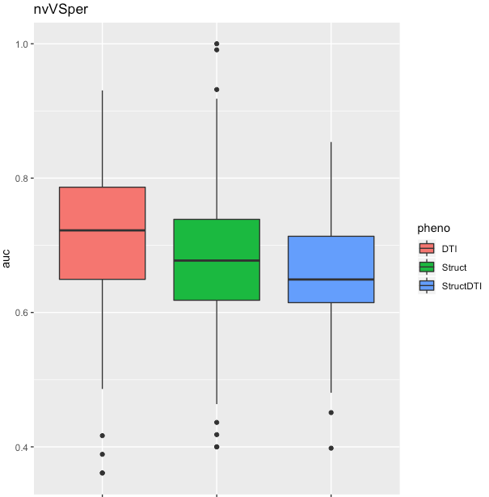
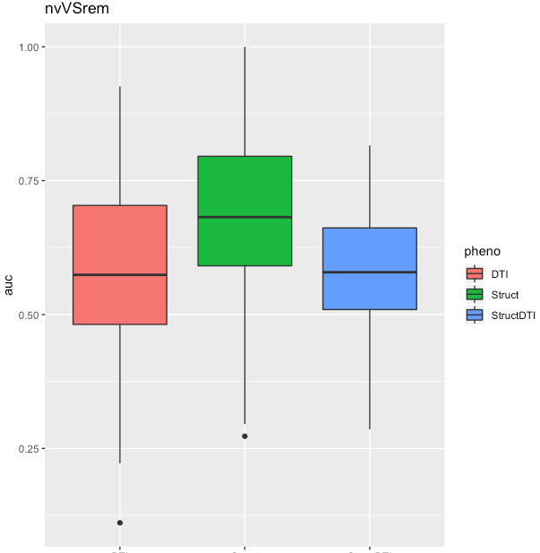
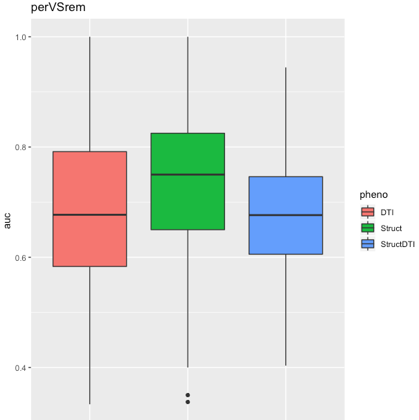
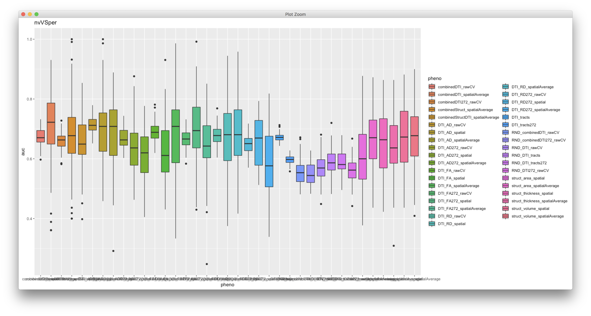
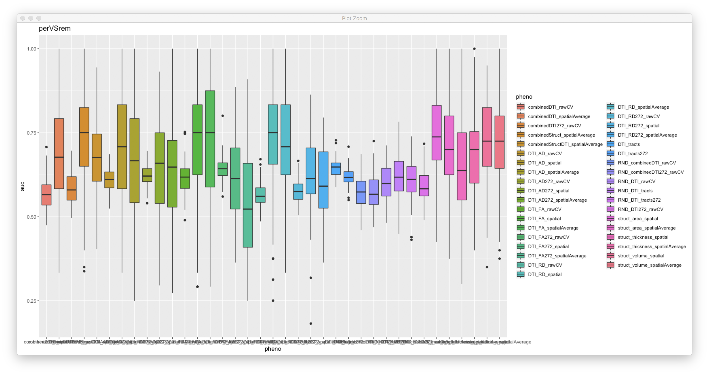
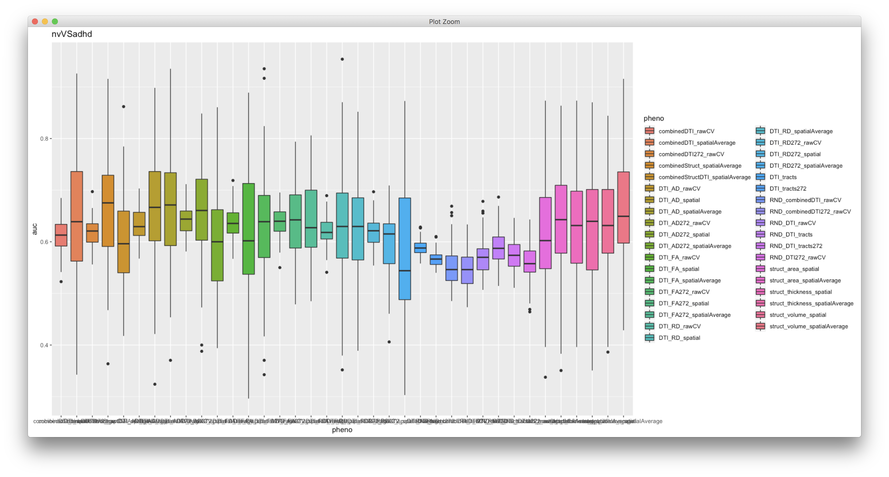
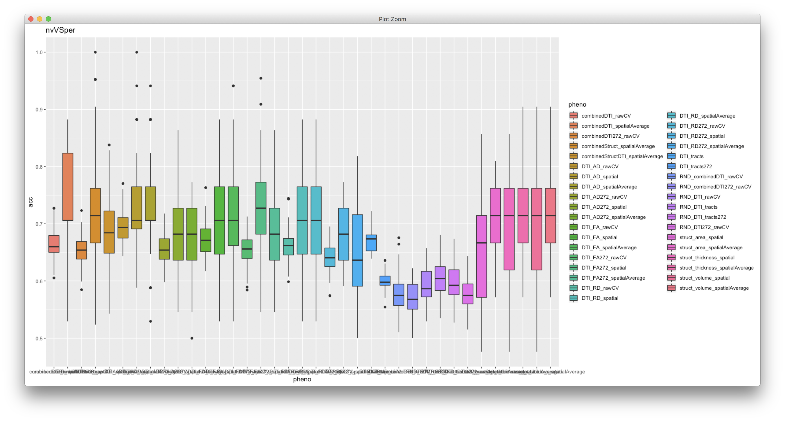
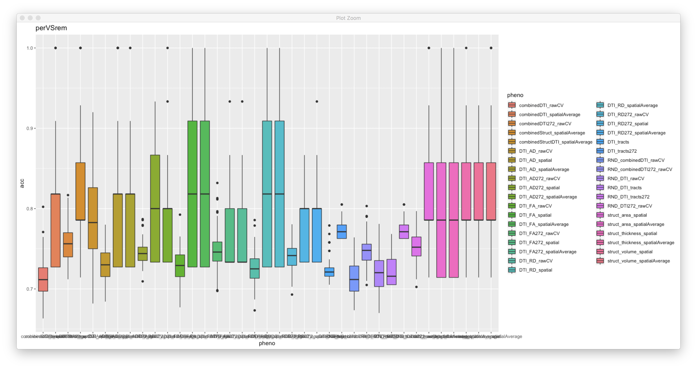
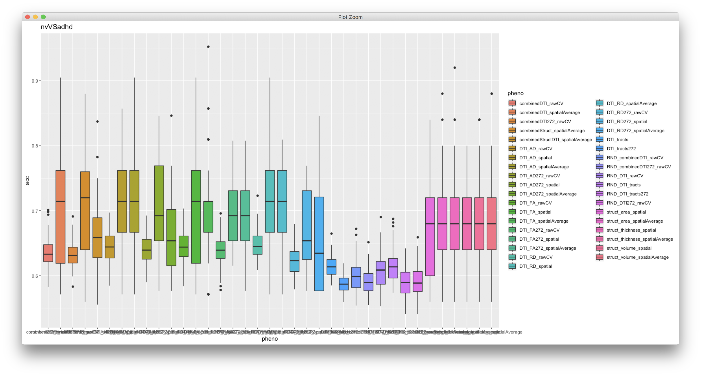

# 2018-11-09 15:51:33

This is the first try combining data cross domains. Let's reduce the variables before we do anything, but we should try it differently later. Also, let's combine everything we have, and we can tailor it down later.

```bash
job_name=combineStructDTI_spatialAvgTestDL;
mydir=/data/NCR_SBRB/baseline_prediction/;
swarm_file=swarm.automl_${job_name};
rm -rf $swarm_file;
f="${mydir}/struct_thickness_09192018_260timeDiff12mo.RData.gz,${mydir}/struct_area_09192018_260timeDiff12mo.RData.gz,${mydir}/struct_volume_09192018_260timeDiff12mo.RData.gz,${mydir}/dti_fa_voxelwise_n223_09212018.RData.gz,${mydir}/dti_ad_voxelwise_n223_09212018.RData.gz,${mydir}/dti_rd_voxelwise_n223_09212018.RData.gz";
mincluster='35,35,35,8,8,8'
for target in nvVSper nvVSrem perVSrem nvVSadhd; do
    for i in {1..100}; do
        echo "Rscript --vanilla ~/research_code/automl/uni_spatialAverage_multiDomain_test_autoValidation_DL.R $f ${mydir}/long_clin_0918.csv ${target} ${mydir}/models_spatial_across_DL/${USER} $RANDOM $mincluster" >> $swarm_file;
    done;
done
sed -i -e "s/^/unset http_proxy; /g" $swarm_file;
swarm -f $swarm_file -g 40 -t 16 --time 6:00:00 --partition norm --logdir trash_${job_name} --job-name ${job_name} -m R,afni --gres=lscratch:10 2> swarm_wait_${USER};
```

But of course we should look into combining just within domain for comparison:

```bash
job_name=combineStruct_spatialAvgTestDL;
mydir=/data/NCR_SBRB/baseline_prediction/;
swarm_file=swarm.automl_${job_name};
rm -rf $swarm_file;
f="${mydir}/struct_thickness_09192018_260timeDiff12mo.RData.gz,${mydir}/struct_area_09192018_260timeDiff12mo.RData.gz,${mydir}/struct_volume_09192018_260timeDiff12mo.RData.gz";
mincluster='35,35,35'
for target in nvVSper nvVSrem perVSrem nvVSadhd; do
    for i in {1..100}; do
        echo "Rscript --vanilla ~/research_code/automl/uni_spatialAverage_multiDomain_test_autoValidation_DL.R $f ${mydir}/long_clin_0918.csv ${target} ${mydir}/models_spatial_across_DL/${USER} $RANDOM $mincluster" >> $swarm_file;
    done;
done
sed -i -e "s/^/unset http_proxy; /g" $swarm_file;
swarm -f $swarm_file -g 40 -t 16 --time 6:00:00 --partition norm --logdir trash_${job_name} --job-name ${job_name} -m R,afni --gres=lscratch:10 2> swarm_wait_${USER};
```

```bash
job_name=combineDTI_spatialAvgTestDL;
mydir=/data/NCR_SBRB/baseline_prediction/;
swarm_file=swarm.automl_${job_name};
rm -rf $swarm_file;
f="${mydir}/dti_fa_voxelwise_n223_09212018.RData.gz,${mydir}/dti_ad_voxelwise_n223_09212018.RData.gz,${mydir}/dti_rd_voxelwise_n223_09212018.RData.gz";
mincluster='8,8,8'
for target in nvVSper nvVSrem perVSrem nvVSadhd; do
    for i in {1..100}; do
        echo "Rscript --vanilla ~/research_code/automl/uni_spatialAverage_multiDomain_test_autoValidation_DL.R $f ${mydir}/long_clin_0918.csv ${target} ${mydir}/models_spatial_across_DL/${USER} $RANDOM $mincluster" >> $swarm_file;
    done;
done
sed -i -e "s/^/unset http_proxy; /g" $swarm_file;
swarm -f $swarm_file -g 40 -t 16 --time 6:00:00 --partition norm --logdir trash_${job_name} --job-name ${job_name} -m R,afni --gres=lscratch:10 2> swarm_wait_${USER};
```

# 2018-11-13 13:43:57

Let's evaluate the results:

```bash
echo "target,pheno,var,seed,nfeat,model,auc,f1,acc,ratio" > combinedSpatialAverageTest_summary.csv;
for dir in DTI Struct StructDTI; do
    echo $dir;
    for f in `ls -1 trash_combine${dir}_spatialAvgTestDL/*o`; do
        phen=$dir;
        target=`head -n 2 $f | tail -1 | awk '{FS=" "; print $9}'`;
        seed=`head -n 2 $f | tail -1 | awk '{FS=" "; print $11}'`;
        var=`head -n 2 $f | tail -1 | awk '{FS=" "; print $6}' | cut -d"/" -f 4 | sed -e "s/\.R//g"`;
        model=`grep -A 1 model_id $f | tail -1 | awk '{FS=" "; print $2}' | cut -d"_" -f 1`;
        auc=`grep -A 1 model_id $f | tail -1 | awk '{FS=" "; print $3}'`;
        nfeat=`grep "Running model on" $f | awk '{FS=" "; print $5}'`;
        ratio=`grep -A 1 "Class distribution" $f | tail -1 | awk '{FS=" "; {for (i=2; i<=NF; i++) printf $i ";"}}'`;
        f1=`grep -A 2 "Maximum Metrics:" $f | tail -1 | awk '{FS=" "; print $5}'`;
        acc=`grep -A 5 "Maximum Metrics:" $f | tail -1 | awk '{FS=" "; print $5}'`;
        echo $target,$phen,$var,$seed,$nfeat,$model,$auc,$f1,$acc,$ratio >> combinedSpatialAverageTest_summary.csv;
    done;
done;
```








## State of the union

It's wise to create some plots that combine where we are in all our experiments.
Of interest here, we should plot within domain (spatial, spatial average, raw),
then across domain. Let's do every target for AUC and accuracy.

I don't think it's necessary to include the other failed attempts of
dimensionality reduction. The only other thing after this will be adding in
rsFMRI.

```r
> data = read.csv('~/Documents/baseline_prediction/summary_11132018.csv')
> target='nvVSper'
> p1<-ggplot(data[data$target == target,], aes(x=pheno, y=auc, fill=pheno))
> print(p1+geom_boxplot() + ggtitle(target))
```








And these are for accuracy:








OK, so what are the main points?

 * rawCV has way smaller variance than using a test set. The median using a test
   set might actually be higher, but we'd need to find a better ratio for
   test/train, which might reduce the median even further.
 * we need to test a combined version for rawCV, but it doesn't run for struct,
   so we'd need to downsample that first.
 * if we selected trully good clusters, would it make a difference in the variance?
 * there isn't much of a difference between spatial and spatialAverage.
 * combining structural and DTI after spatialaverage actually didn't help. 

What if I switched strategies? Basically, make it into a neuroimaging study,
using either 3dClustSim or, ideally, permutations to get only good clusters.
Then use those clusters for the entire dataset, produce the best model we can
with that (cheating, but we're upfront about it), and then actually test it on a
new dataset Wendy is putting together? The trick here is the case when no
significant cluster comes up. We might need to play with thereholds there. Or
maybe go back to running older tests, instead of pairwise as we're doing now.

# 2018-11-15 11:08:52

I'm doing some tests with memory needs... so, using DRF and 2 DTI datasets (only 5 models, though), I needed 16Gb. For DeepLearning 56Gb, GBM 41. All nvVSadhd.

Then, using 3 DTI datasets, DRF needed 18Gb, GBM p4, GLM 14, and DL p3.

Using all 3 struct datasets, DRF needed 21Gb, GBM 32, GLM 4, and DL 32.

Finally, using all 6 datasets, DRF needed 31, GBM j4, GLM 20, and DL g4.

All tests run in a 32 core machine (sin). But it's highly possible that other models in the full grid search will take more memory!

Some are taking longer than others, but I haven't seen anything fo above 60 yet...

Let's go ahead and run the entire struct and DTI combination to see what we get:

```bash
job_name=combinedDTIStructDS_rawDL;
mydir=/data/NCR_SBRB/baseline_prediction/;
swarm_file=swarm.automl_${job_name};
rm -rf $swarm_file;
f="${mydir}/dti_fa_voxelwise_n223_09212018.RData.gz,${mydir}/dti_ad_voxelwise_n223_09212018.RData.gz,${mydir}/dti_rd_voxelwise_n223_09212018.RData.gz,${mydir}/struct_area_11142018_260timeDiff12mo.RData.gz,${mydir}/struct_volume_11142018_260timeDiff12mo.RData.gz,${mydir}/struct_thickness_11142018_260timeDiff12mo.RData.gz";
for target in nvVSper nvVSrem perVSrem nvVSadhd; do
    for i in {1..100}; do
        myseed=$RANDOM;
        echo "Rscript --vanilla ~/research_code/automl/raw_multiDomain_autoValidation_oneAlgo.R $f ${mydir}/long_clin_0918.csv ${target} ${mydir}/models_raw_within_DL/${USER}  $myseed DeepLearning" >> $swarm_file;
        echo "Rscript --vanilla ~/research_code/automl/raw_multiDomain_autoValidation_oneAlgo.R $f ${mydir}/long_clin_0918.csv ${target} ${mydir}/models_raw_within_DL/${USER}  -$myseed DeepLearning" >> $swarm_file;
    done;
done
sed -i -e "s/^/unset http_proxy; /g" $swarm_file;
swarm -f $swarm_file -g 60 -t 16 --time 3:00:00 --partition norm --logdir trash_${job_name} --job-name ${job_name} -m R --gres=lscratch:10;
```

And just for comparison, and because it should run somewhat fast, let's run only DRF:

```bash
job_name=combinedDTIStructDS_rawDRF;
mydir=/data/NCR_SBRB/baseline_prediction/;
swarm_file=swarm.automl_${job_name};
rm -rf $swarm_file;
f="${mydir}/dti_fa_voxelwise_n223_09212018.RData.gz,${mydir}/dti_ad_voxelwise_n223_09212018.RData.gz,${mydir}/dti_rd_voxelwise_n223_09212018.RData.gz,${mydir}/struct_area_11142018_260timeDiff12mo.RData.gz,${mydir}/struct_volume_11142018_260timeDiff12mo.RData.gz,${mydir}/struct_thickness_11142018_260timeDiff12mo.RData.gz";
for target in nvVSper nvVSrem perVSrem nvVSadhd; do
    for i in {1..100}; do
        myseed=$RANDOM;
        echo "Rscript --vanilla ~/research_code/automl/raw_multiDomain_autoValidation_oneAlgo.R $f ${mydir}/long_clin_0918.csv ${target} ${mydir}/models_raw_within_DL/${USER}  $myseed DRF" >> $swarm_file;
        echo "Rscript --vanilla ~/research_code/automl/raw_multiDomain_autoValidation_oneAlgo.R $f ${mydir}/long_clin_0918.csv ${target} ${mydir}/models_raw_within_DL/${USER}  -$myseed DRF" >> $swarm_file;
    done;
done
sed -i -e "s/^/unset http_proxy; /g" $swarm_file;
swarm -f $swarm_file -g 60 -t 16 --time 3:00:00 --partition norm --logdir trash_${job_name} --job-name ${job_name} -m R --gres=lscratch:10;
```

Should we maybe run GBM as well?

