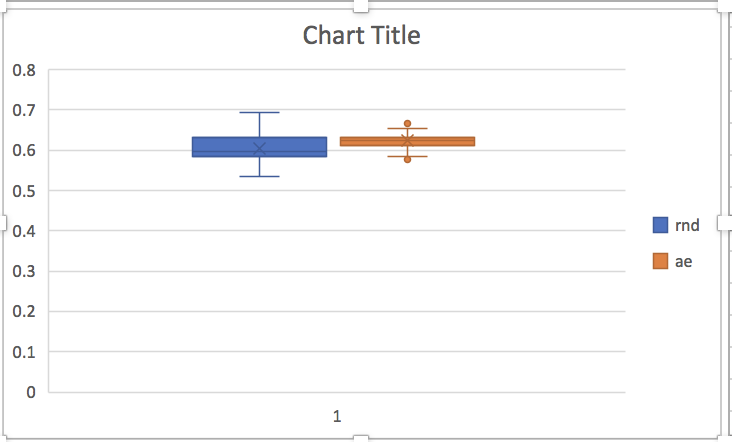

# 2018-10-24 15:23:18

The idea here is to optimize as much as we can the autoencoders to find an optimal lower respresentation space of our data. We can easily think of our fMRI correlation matrix as a 2D image, and the DTI as a 3D image. I'm not sure what to make of the structural image, but if it's not in a 3D format we can easily shape it to be that (or even 2D).

So, I'm following code from:

https://www.datacamp.com/community/tutorials/autoencoder-keras-tutorial

but also 

https://blog.keras.io/building-autoencoders-in-keras.html

So, first thing is to save the fMRI correlation matrices as 2D, or the DTI as 3D. Let's go with DTI because we're benchmarking much of our other stuff like that.

```python
import nibabel as nb
import pandas as pd
import numpy as np

fname = '/Users/sudregp/data/baseline_prediction/dti_gf_09212018_223timeDiff12mo.csv'
pheno = pd.read_csv(fname)
all_data = []
for m in pheno['mask.id']:
    print(m)
    data_fname = '/Volumes/Shaw/dti_robust_tsa/analysis_may2017/%04d_tensor_diffeo_ad.nii.gz' % m
    img = nb.load(data_fname)
    subj_data = img.get_data()
    all_data.append(subj_data)
d = np.array(all_data)
np.savez('/Users/sudregp/tmp/ad_223_3d.npz', data=d)
```

I've been playing with the optimizing autoencoder code (non-convulaiton), but I'm reaching an asymptote of .0317, not overfitting. But that's using a very simple sigmoid model with 50 hidden neurons. I've trying much more complex stuff, deeper and bigger, but nothing is doing better. Maybe try playing with other parameters?

Also, it's true that using GPU makes it muuuuuuch faster.

Just note that we're not making use of the spatial information in the images, so that's why it might be better to use the convolution networks. We just need to understand how to best capture the lower dimensional model.

Use this example instead!!! https://blog.keras.io/building-autoencoders-in-keras.html

they show how to get the low-dimensional representation, and we can always adapt
the training later.

# 2018-10-26 09:28:27

I ran several tests under crossvalidation for the convulation 3d network. Here
are the results:

Best: -0.004423 using {'init_mode': 'lecun_uniform'}
-0.010433 (0.002859) with: {'init_mode': 'uniform'}
-0.004423 (0.000073) with: {'init_mode': 'lecun_uniform'}
-0.004437 (0.000134) with: {'init_mode': 'normal'}
-0.011900 (0.000097) with: {'init_mode': 'zero'}
-0.004460 (0.000243) with: {'init_mode': 'glorot_normal'}
-0.004514 (0.000177) with: {'init_mode': 'glorot_uniform'}
-0.006047 (0.002933) with: {'init_mode': 'he_normal'}
-0.004625 (0.000197) with: {'init_mode': 'he_uniform'}

Best: -0.004462 using {'activation': 'relu'}
-0.925986 (0.000226) with: {'activation': 'softmax'}
-0.004970 (0.000133) with: {'activation': 'softplus'}
-0.004925 (0.000082) with: {'activation': 'softsign'}
-0.004462 (0.000103) with: {'activation': 'relu'}
-0.004800 (0.000057) with: {'activation': 'tanh'}
-0.009283 (0.000096) with: {'activation': 'sigmoid'}
-0.011900 (0.000097) with: {'activation': 'hard_sigmoid'}
-0.004872 (0.000050) with: {'activation': 'linear'}

Best: -0.003743 using {'optimizer': 'Adam'}
-0.008223 (0.000965) with: {'optimizer': 'SGD'}
-0.003952 (0.000186) with: {'optimizer': 'RMSprop'}
-0.006262 (0.002875) with: {'optimizer': 'Adagrad'}
-0.004404 (0.000060) with: {'optimizer': 'Adadelta'}
-0.003743 (0.000075) with: {'optimizer': 'Adam'}
-0.003807 (0.000045) with: {'optimizer': 'Adamax'}
-0.003796 (0.000060) with: {'optimizer': 'Nadam'}

OK, so let's change back our main function to see what we get.

Then I started playing with batch sizes, and with 5 I get .0037, same thing with
2. With 1 I can get to .0036, and it doesn't look like it's overfitting. So,
   maybe we stick with that and see how well it performs in decoding? That was
   all using seed 7, so of course these will change when I use a different seed.
   But hopefully the group of best parameters stays the same.


So, after running python ~/research_code/automl/optimize_convolution3d.py, we do: 

```python
import numpy as np
import pandas as pd


a = np.load('/data/NCR_SBRB/baseline_prediction/lowDim_AD.npz')[('data')]
b = a.reshape([223, -1])
pd.DataFrame(b).to_csv('~/tmp/a.csv')
```

And then in R to make the features look nicer:

```r
data = read.csv('~/tmp/a.csv')
data = data[,2:ncol(data)]
cnames = sapply(1:ncol(data), function(x) sprintf('v_AE%02d', x))
colnames(data) = cnames
data2 = data
load('/data/NCR_SBRB/baseline_prediction/dti_ad_voxelwise_n223_09212018.RData.gz')
data = cbind(data$MRN, data2)
colnames(data)[1] = 'MRN'
save(data,file='/data/NCR_SBRB/baseline_prediction/dti_ad_AE_n223_10262018.RData.gz')
```

OK, now that this is working, time for a quick evaluation:

```bash
job_name=adAE;
swarm_file=swarm.automl_${job_name};
f=/data/NCR_SBRB/baseline_prediction/dti_ad_AE_n223_10262018.RData.gz;
rm -rf $swarm_file;
for target in nvVSper perVSrem nvVSrem; do
    for i in {1..100}; do
        myseed=$RANDOM
        echo "Rscript --vanilla ~/research_code/automl/raw_autoValidation.R $f /data/NCR_SBRB/baseline_prediction/long_clin_0918.csv ${target} /data/NCR_SBRB/baseline_prediction/models_test_raw/${USER} $myseed" >> $swarm_file;
        echo "Rscript --vanilla ~/research_code/automl/raw_autoValidation.R $f /data/NCR_SBRB/baseline_prediction/long_clin_0918.csv ${target} /data/NCR_SBRB/baseline_prediction/models_test_raw/${USER} -$myseed" >> $swarm_file;
    done;
done;
sed -i -e "s/^/unset http_proxy; /g" $swarm_file;
swarm -f $swarm_file -g 16 -t 32 --time 3:00:00 --partition quick --logdir trash_${job_name} --job-name ${job_name} -m R --gres=lscratch:10;
```

# 2018-10-29 10:03:52

Let's see what we get:

```bash
echo "target,pheno,var,seed,nfeat,model,auc,f1,acc,ratio" > adAE_summary.csv;
dir=adAE;
for f in `ls trash_${dir}/*o`; do
    phen=`head -n 2 $f | tail -1 | awk '{FS=" "; print $6}' | cut -d"/" -f 5`;
    target=`head -n 2 $f | tail -1 | awk '{FS=" "; print $8}'`;
    seed=`head -n 2 $f | tail -1 | awk '{FS=" "; print $10}'`;
    var=`head -n 2 $f | tail -1 | awk '{FS=" "; print $5}' | cut -d"/" -f 4 | sed -e "s/\.R//g"`;
    model=`grep -A 1 model_id $f | tail -1 | awk '{FS=" "; print $2}' | cut -d"_" -f 1`;
    auc=`grep -A 1 model_id $f | tail -1 | awk '{FS=" "; print $3}'`;
    nfeat=`grep "Running model on" $f | awk '{FS=" "; print $5}'`;
    ratio=`grep -A 1 "Class distribution" $f | tail -1 | awk '{FS=" "; {for (i=2; i<=NF; i++) printf $i ";"}}'`;
    f1=`grep -A 2 "Maximum Metrics:" $f | tail -1 | awk '{FS=" "; print $5}'`;
    acc=`grep -A 5 "Maximum Metrics:" $f | tail -1 | awk '{FS=" "; print $5}'`;
    echo $target,$phen,$var,$seed,$nfeat,$model,$auc,$f1,$acc,$ratio >> adAE_summary.csv;
done;
```

No, this didn't work either (nvVSper ACC):



The last hope in dimensionality reduction is ICA, but that's not looking so hot
either.

Maybe another way we could reduce our dimensions is by using our results from
previous papers?

