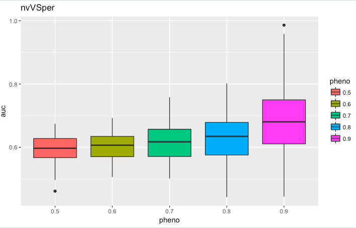
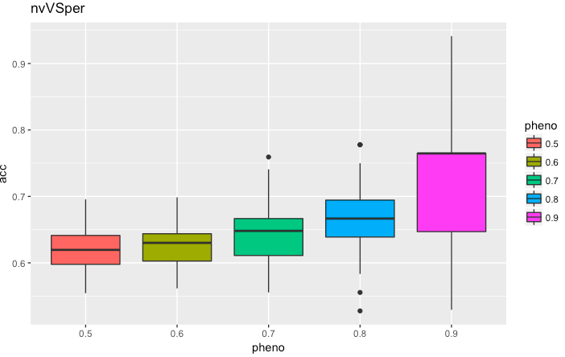

# 2018-11-13 15:33:10

I'm going to check how different test ratios affect the spatialAverage results.
We run the 90/10 we normally do, but go all the way down to 50/50. Let's stick
to a given target and property for now.

```bash
job_name=DTIAD_spatialAvgTestRatiosDL;
mydir=/data/NCR_SBRB/baseline_prediction/;
swarm_file=swarm.automl_${job_name};
rm -rf $swarm_file;
f="${mydir}/dti_fa_voxelwise_n223_09212018.RData.gz";
mincluster='8';
target=nvVSper;
for train in .5 .6 .7 .8 .9; do
    for i in {1..100}; do
        echo "Rscript --vanilla ~/research_code/automl/uni_spatialAverage_multiDomain_varTest_autoValidation_DL.R $f ${mydir}/long_clin_0918.csv ${target} ${mydir}/tmp/${USER} $RANDOM $mincluster $train" >> $swarm_file;
    done;
done
sed -i -e "s/^/unset http_proxy; /g" $swarm_file;
swarm -f $swarm_file -g 40 -t 16 --time 6:00:00 --partition norm --logdir trash_${job_name} --job-name ${job_name} -m R,afni --gres=lscratch:10 2> swarm_wait_${USER};
```

# 2018-11-14 12:39:33

```bash
echo "target,pheno,var,seed,nfeat,model,auc,f1,acc,ratio" > varTestSpatialAverageTest_summary.csv;
dir=trash_DTIAD_spatialAvgTestRatiosDL;
for f in `ls -1 ${dir}/*o`; do
    phen=`head -n 2 $f | tail -1 | awk '{FS=" "; print $13}'`;
    target=`head -n 2 $f | tail -1 | awk '{FS=" "; print $9}'`;
    seed=`head -n 2 $f | tail -1 | awk '{FS=" "; print $11}'`;
    var=`head -n 2 $f | tail -1 | awk '{FS=" "; print $6}' | cut -d"/" -f 4 | sed -e "s/\.R//g"`;
    model=`grep -A 1 model_id $f | tail -1 | awk '{FS=" "; print $2}' | cut -d"_" -f 1`;
    auc=`grep -A 1 model_id $f | tail -1 | awk '{FS=" "; print $3}'`;
    nfeat=`grep "Running model on" $f | awk '{FS=" "; print $5}'`;
    ratio=`grep -A 1 "Class distribution" $f | tail -1 | awk '{FS=" "; {for (i=2; i<=NF; i++) printf $i ";"}}'`;
    f1=`grep -A 2 "Maximum Metrics:" $f | tail -1 | awk '{FS=" "; print $5}'`;
    acc=`grep -A 5 "Maximum Metrics:" $f | tail -1 | awk '{FS=" "; print $5}'`;
    echo $target,$phen,$var,$seed,$nfeat,$model,$auc,$f1,$acc,$ratio >> varTestSpatialAverageTest_summary.csv;
done;
```

```r
data = read.csv('~/tmp/varTestSpatialAverageTest_summary.csv')
target='nvVSper'
data$pheno = as.character(data$pheno)
p1<-ggplot(data[data$target == target,], aes(x=pheno, y=auc, fill=pheno))
print(p1+geom_boxplot() + ggtitle(target))
```





So, it's prety much what we're expecting. The bigger the training set, the better we learn, but the model becomes less flexible, generating higher variability in the test set. 

So, in that sense it's better to just stick with our raw feature selection and rawCV. Let's focus on reducing the dimensionality of structural then, so we can do some sort of concatenation.

