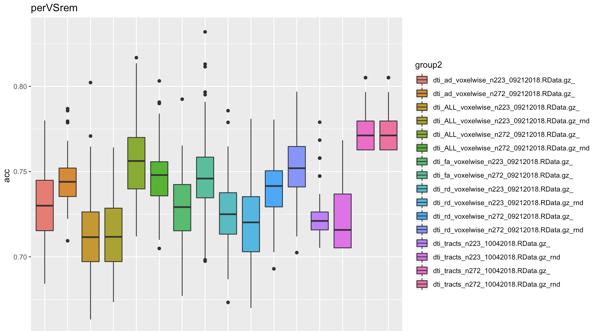
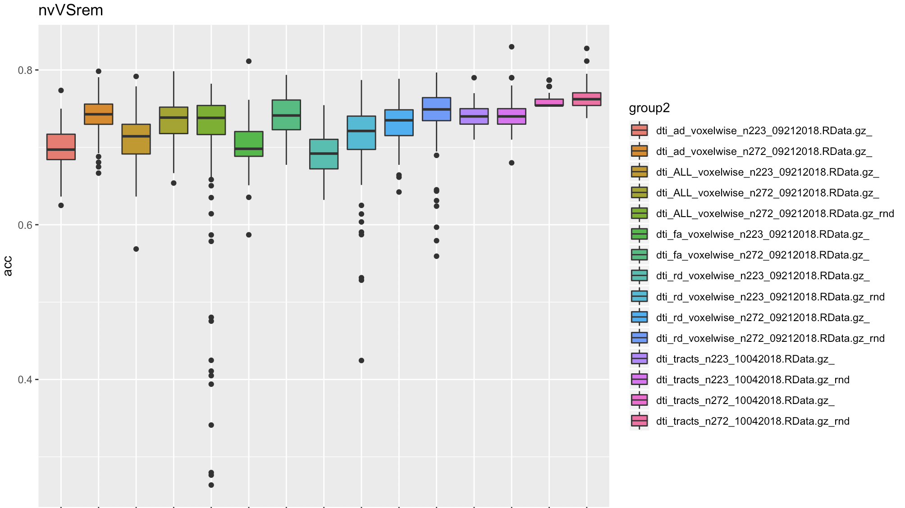
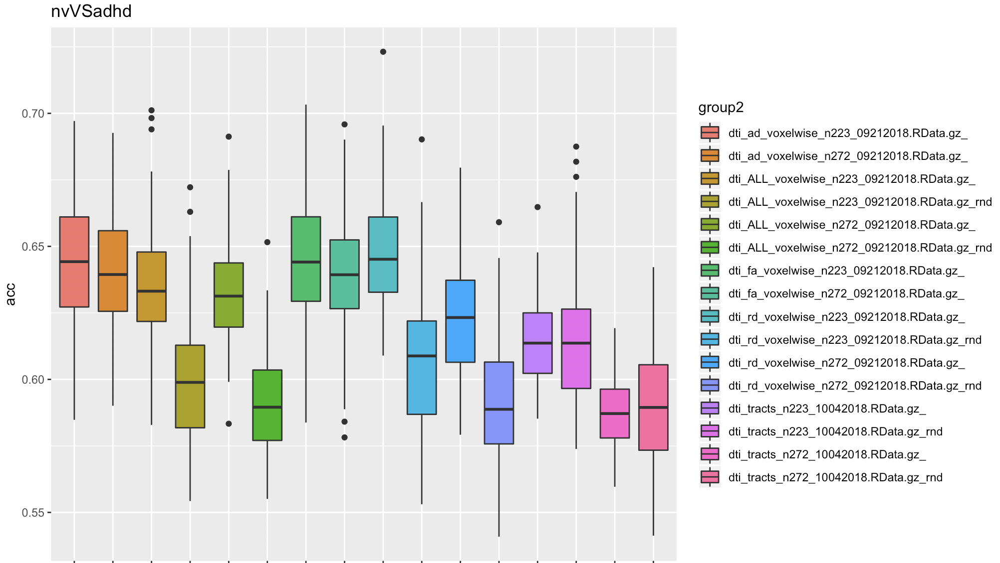
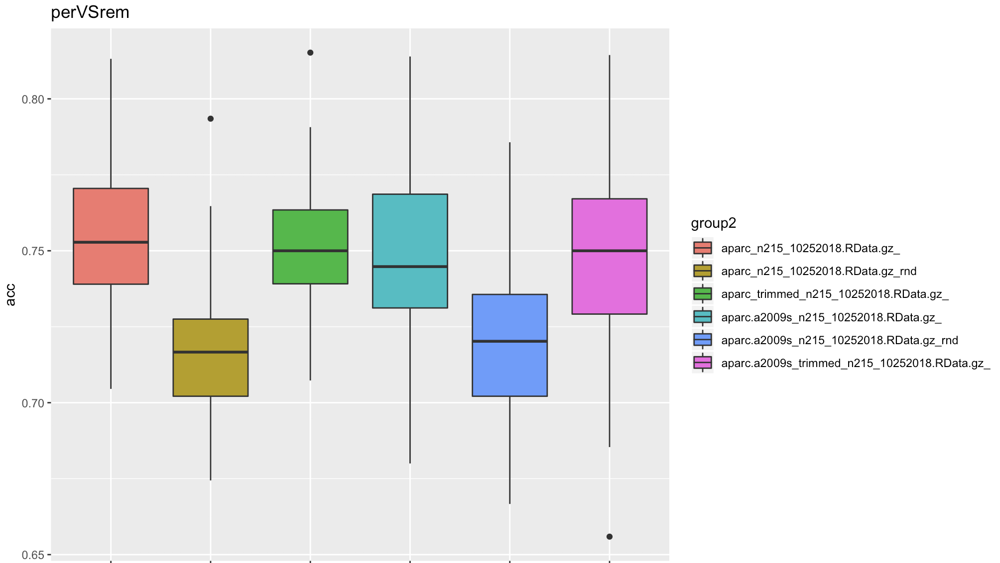

# 2018-10-19 11:23:28

Now that we have a bit better testing framework, let's repeat the
within-modality assessment of datasets and see which ones fare best.

## DTI

```bash
job_name=withinDTI_DL;
mydir=/data/NCR_SBRB/baseline_prediction/;
swarm_file=swarm.automl_${job_name};
rm -rf $swarm_file;
for f in dti_ALL_voxelwise_n223_09212018.RData.gz dti_ALL_voxelwise_n272_09212018.RData.gz \
    dti_fa_voxelwise_n223_09212018.RData.gz dti_fa_voxelwise_n272_09212018.RData.gz \
    dti_ad_voxelwise_n223_09212018.RData.gz dti_ad_voxelwise_n272_09212018.RData.gz \
    dti_rd_voxelwise_n223_09212018.RData.gz dti_rd_voxelwise_n272_09212018.RData.gz \
    dti_tracts_n223_10042018.RData.gz dti_tracts_n272_10042018.RData.gz; do
    for target in nvVSper nvVSrem perVSrem nvVSadhd; do
        for i in {1..100}; do
            echo "Rscript --vanilla ~/research_code/automl/uni_test_autoValidation_DL.R ${mydir}/$f ${mydir}/long_clin_0918.csv ${target} ${mydir}/models_within_DL/${USER} $RANDOM" >> $swarm_file;
        done;
    done;
done
sed -i -e "s/^/unset http_proxy; /g" $swarm_file;
split -l 1000 $swarm_file ${job_name}_split;
for f in `/bin/ls ${job_name}_split??`; do
    echo "ERROR" > swarm_wait_${USER}
    while grep -q ERROR swarm_wait_${USER}; do
        echo "Trying $f"
        swarm -f $f -g 60 -t 16 --time 3:00:00 --partition norm --logdir trash_${job_name} --job-name ${job_name} -m R --gres=lscratch:10 2> swarm_wait_${USER};
        if grep -q ERROR swarm_wait_${USER}; then
            echo -e "\tError, sleeping..."
            sleep 10m;
        fi;
    done;
done
```

## Structural

```bash
job_name=withinStruct_DL;
mydir=/data/NCR_SBRB/baseline_prediction/;
swarm_file=swarm.automl_${job_name};
rm -rf $swarm_file;
for f in struct_thickness_09192018_260timeDiff12mo.RData.gz \
    struct_area_09192018_260timeDiff12mo.RData.gz \
    struct_volume_09192018_260timeDiff12mo.RData.gz \
    struct_rois_09192018_260timeDiff12mo.RData.gz;  do
    for target in nvVSper nvVSrem perVSrem nvVSadhd; do
        for i in {1..100}; do
            echo "Rscript --vanilla ~/research_code/automl/uni_test_autoValidation_DL.R ${mydir}/$f ${mydir}/long_clin_0918.csv ${target} ${mydir}/models_within_DL/${USER} $RANDOM" >> $swarm_file;
        done;
    done;
done
sed -i -e "s/^/unset http_proxy; /g" $swarm_file;
split -l 1000 $swarm_file ${job_name}_split;
for f in `/bin/ls ${job_name}_split??`; do
    echo "ERROR" > swarm_wait_${USER}
    while grep -q ERROR swarm_wait_${USER}; do
        echo "Trying $f"
        swarm -f $f -g 60 -t 16 --time 3:00:00 --partition norm --logdir trash_${job_name} --job-name ${job_name} -m R --gres=lscratch:10 2> swarm_wait_${USER};
        if grep -q ERROR swarm_wait_${USER}; then
            echo -e "\tError, sleeping..."
            sleep 10m;
        fi;
    done;
done
```

## rsFMRI

```bash
job_name=withinResting_DL;
mydir=/data/NCR_SBRB/baseline_prediction/;
swarm_file=swarm.automl_${job_name};
rm -rf $swarm_file;
for f in aparc.a2009s_n215_09182018.RData.gz \
    aparc.a2009s_trimmed_n215_09182018.RData.gz \
    aparc_n215_09182018.RData.gz \
    aparc_trimmed__n215_09182018.RData.gz;  do
    for target in nvVSper nvVSrem perVSrem nvVSadhd; do
        for i in {1..100}; do
            echo "Rscript --vanilla ~/research_code/automl/uni_test_autoValidation_DL.R ${mydir}/$f ${mydir}/long_clin_0918.csv ${target} ${mydir}/models_within_DL/${USER} $RANDOM" >> $swarm_file;
        done;
    done;
done
sed -i -e "s/^/unset http_proxy; /g" $swarm_file;
split -l 1000 $swarm_file ${job_name}_split;
for f in `/bin/ls ${job_name}_split??`; do
    echo "ERROR" > swarm_wait_${USER}
    while grep -q ERROR swarm_wait_${USER}; do
        echo "Trying $f"
        swarm -f $f -g 60 -t 16 --time 3:00:00 --partition norm --logdir trash_${job_name} --job-name ${job_name} -m R --gres=lscratch:10 2> swarm_wait_${USER};
        if grep -q ERROR swarm_wait_${USER}; then
            echo -e "\tError, sleeping..."
            sleep 10m;
        fi;
    done;
done
```

## genetics

```bash
job_name=withinSNPs_DL;
mydir=/data/NCR_SBRB/baseline_prediction/;
swarm_file=swarm.automl_${job_name};
rm -rf $swarm_file;
for f in geno3_snps1e04_09192018.RData.gz geno3_snps1e05_09192018.RData.gz \
    geno3_snps1e05_09192018.RData.gz geno3_snps1e07_09192018.RData.gz \
    geno3_snps1e08_09192018.RData.gz geno3_snps1e09_09192018.RData.gz \
    geno3_prs_09192018.RData.gz;  do
    for target in nvVSper nvVSrem perVSrem nvVSadhd; do
        for i in {1..100}; do
            echo "Rscript --vanilla ~/research_code/automl/uni_test_autoValidation_DL.R ${mydir}/$f ${mydir}/long_clin_0918.csv ${target} ${mydir}/models_within_DL/${USER} $RANDOM" >> $swarm_file;
        done;
    done;
done
sed -i -e "s/^/unset http_proxy; /g" $swarm_file;
split -l 1000 $swarm_file ${job_name}_split;
for f in `/bin/ls ${job_name}_split??`; do
    echo "ERROR" > swarm_wait_${USER}
    while grep -q ERROR swarm_wait_${USER}; do
        echo "Trying $f"
        swarm -f $f -g 60 -t 16 --time 3:00:00 --partition norm --logdir trash_${job_name} --job-name ${job_name} -m R --gres=lscratch:10 2> swarm_wait_${USER};
        if grep -q ERROR swarm_wait_${USER}; then
            echo -e "\tError, sleeping..."
            sleep 10m;
        fi;
    done;
done
```

# 2018-10-22 09:23:25

And now we need to grab the results:

```bash
echo "target,pheno,var,seed,nfeat,model,auc,f1,acc,spec,sens,prec,ratio" > withinDomainAutoframeDL_summary.csv;
for dir in DTI_DL Resting_DL SNPs_DL Struct_DL; do
    echo $dir
    for f in `ls trash_within${dir}/*o`; do
        phen=`head -n 2 $f | tail -1 | awk '{FS=" "; print $7}' | cut -d"/" -f 5`;
        target=`head -n 2 $f | tail -1 | awk '{FS=" "; print $8}'`;
        seed=`head -n 2 $f | tail -1 | awk '{FS=" "; print $10}'`;
        var=`head -n 2 $f | tail -1 | awk '{FS=" "; print $5}' | cut -d"/" -f 4 | sed -e "s/\.R//g"`;
        model=`grep -A 1 model_id $f | tail -1 | awk '{FS=" "; print $2}' | cut -d"_" -f 1`;
        auc=`grep -A 1 model_id $f | tail -1 | awk '{FS=" "; print $3}'`;
        nfeat=`grep "Running model on" $f | awk '{FS=" "; print $5}'`;
        ratio=`grep -A 1 "Class distribution" $f | tail -1 | awk '{FS=" "; {for (i=2; i<=NF; i++) printf $i ";"}}'`;
        f1=`grep -A 2 "Maximum Metrics:" $f | tail -1 | awk '{FS=" "; print $5}'`;
        acc=`grep -A 5 "Maximum Metrics:" $f | tail -1 | awk '{FS=" "; print $5}'`;
        spec=`grep -A 8 "Maximum Metrics:" $f | tail -1 | awk '{FS=" "; print $5}'`;
        sens=`grep -A 7 "Maximum Metrics:" $f | tail -1 | awk '{FS=" "; print $5}'`;
        prec=`grep -A 6 "Maximum Metrics:" $f | tail -1 | awk '{FS=" "; print $5}'`
        echo $target,$phen,$var,$seed,$nfeat,$model,$auc,$f1,$acc,$spec,$sens,$prec,$ratio >> withinDomainAutoframeDL_summary.csv;
    done;
done
```

# 2018-10-25 11:50:35

Now that I know things are not doing so hot for PCA compared to raw, and while I
play with ICA and AE on the side, let's check what's really the best phenotype
within modality using raw, so that we can start to combine them and see if
anything comes up that way.

```bash
job_name=withinDTI_rawDL;
mydir=/data/NCR_SBRB/baseline_prediction/;
swarm_file=swarm.automl_${job_name};
rm -rf $swarm_file;
for f in dti_ALL_voxelwise_n223_09212018.RData.gz dti_ALL_voxelwise_n272_09212018.RData.gz \
    dti_fa_voxelwise_n223_09212018.RData.gz dti_fa_voxelwise_n272_09212018.RData.gz \
    dti_ad_voxelwise_n223_09212018.RData.gz dti_ad_voxelwise_n272_09212018.RData.gz \
    dti_rd_voxelwise_n223_09212018.RData.gz dti_rd_voxelwise_n272_09212018.RData.gz \
    dti_tracts_n223_10042018.RData.gz dti_tracts_n272_10042018.RData.gz; do
    for target in nvVSper nvVSrem perVSrem nvVSadhd; do
        for i in {1..100}; do
            echo "Rscript --vanilla ~/research_code/automl/raw_autoValidation_DL.R ${mydir}/$f ${mydir}/long_clin_0918.csv ${target} ${mydir}/models_raw_within_DL/${USER} $RANDOM" >> $swarm_file;
        done;
    done;
done
for f in dti_ALL_voxelwise_n223_09212018.RData.gz dti_ALL_voxelwise_n272_09212018.RData.gz \
    dti_rd_voxelwise_n223_09212018.RData.gz dti_rd_voxelwise_n272_09212018.RData.gz \
    dti_tracts_n223_10042018.RData.gz dti_tracts_n272_10042018.RData.gz; do
    for target in nvVSper nvVSrem perVSrem nvVSadhd; do
        for i in {1..100}; do
            echo "Rscript --vanilla ~/research_code/automl/raw_autoValidation_DL.R ${mydir}/$f ${mydir}/long_clin_0918.csv ${target} ${mydir}/models_raw_within_DL/${USER} -$RANDOM" >> $swarm_file;
        done;
    done;
done
sed -i -e "s/^/unset http_proxy; /g" $swarm_file;
split -l 1000 $swarm_file ${job_name}_split;
for f in `/bin/ls ${job_name}_split??`; do
    echo "ERROR" > swarm_wait_${USER}
    while grep -q ERROR swarm_wait_${USER}; do
        echo "Trying $f"
        swarm -f $f -g 60 -t 16 --time 3:00:00 --partition norm --logdir trash_${job_name} --job-name ${job_name} -m R --gres=lscratch:10 2> swarm_wait_${USER};
        if grep -q ERROR swarm_wait_${USER}; then
            echo -e "\tError, sleeping..."
            sleep 10m;
        fi;
    done;
done
```

```bash
job_name=withinStruct_rawDL;
mydir=/data/NCR_SBRB/baseline_prediction/;
swarm_file=swarm.automl_${job_name};
rm -rf $swarm_file;
for f in struct_thickness_09192018_260timeDiff12mo.RData.gz \
    struct_area_09192018_260timeDiff12mo.RData.gz \
    struct_volume_09192018_260timeDiff12mo.RData.gz \
    struct_rois_09192018_260timeDiff12mo.RData.gz; do
    for target in nvVSper nvVSrem perVSrem nvVSadhd; do
        for i in {1..100}; do
            echo "Rscript --vanilla ~/research_code/automl/raw_autoValidation_DL.R ${mydir}/$f ${mydir}/long_clin_0918.csv ${target} ${mydir}/models_raw_within_DL/${USER} $RANDOM" >> $swarm_file;
        done;
    done;
done
for f in struct_volume_09192018_260timeDiff12mo.RData.gz \
    struct_rois_09192018_260timeDiff12mo.RData.gz018.RData.gz; do
    for target in nvVSper nvVSrem perVSrem nvVSadhd; do
        for i in {1..100}; do
            echo "Rscript --vanilla ~/research_code/automl/raw_autoValidation_DL.R ${mydir}/$f ${mydir}/long_clin_0918.csv ${target} ${mydir}/models_raw_within_DL/${USER} -$RANDOM" >> $swarm_file;
        done;
    done;
done
sed -i -e "s/^/unset http_proxy; /g" $swarm_file;
split -l 1000 $swarm_file ${job_name}_split;
for f in `/bin/ls ${job_name}_split??`; do
    echo "ERROR" > swarm_wait_${USER}
    while grep -q ERROR swarm_wait_${USER}; do
        echo "Trying $f"
        swarm -f $f -g 60 -t 16 --time 3:00:00 --partition norm --logdir trash_${job_name} --job-name ${job_name} -m R --gres=lscratch:10 2> swarm_wait_${USER};
        if grep -q ERROR swarm_wait_${USER}; then
            echo -e "\tError, sleeping..."
            sleep 10m;
        fi;
    done;
done
```

```bash
job_name=withinResting_rawDL;
mydir=/data/NCR_SBRB/baseline_prediction/;
swarm_file=swarm.automl_${job_name};
rm -rf $swarm_file;
for f in aparc.a2009s_n215_10252018.RData.gz \
    aparc.a2009s_trimmed_n215_10252018.RData.gz \
    aparc_n215_10252018.RData.gz \
    aparc_trimmed_n215_10252018.RData.gz; do
    for target in nvVSper nvVSrem perVSrem nvVSadhd; do
        for i in {1..100}; do
            echo "Rscript --vanilla ~/research_code/automl/raw_autoValidation_DL.R ${mydir}/$f ${mydir}/long_clin_0918.csv ${target} ${mydir}/models_raw_within_DL/${USER} $RANDOM" >> $swarm_file;
        done;
    done;
done
for f in aparc.a2009s_n215_10252018.RData.gz aparc_n215_10252018.RData.gz; do
    for target in nvVSper nvVSrem perVSrem nvVSadhd; do
        for i in {1..100}; do
            echo "Rscript --vanilla ~/research_code/automl/raw_autoValidation_DL.R ${mydir}/$f ${mydir}/long_clin_0918.csv ${target} ${mydir}/models_raw_within_DL/${USER} -$RANDOM" >> $swarm_file;
        done;
    done;
done
sed -i -e "s/^/unset http_proxy; /g" $swarm_file;
split -l 1000 $swarm_file ${job_name}_split;
for f in `/bin/ls ${job_name}_split??`; do
    echo "ERROR" > swarm_wait_${USER}
    while grep -q ERROR swarm_wait_${USER}; do
        echo "Trying $f"
        swarm -f $f -g 60 -t 16 --time 3:00:00 --partition norm --logdir trash_${job_name} --job-name ${job_name} -m R --gres=lscratch:10 2> swarm_wait_${USER};
        if grep -q ERROR swarm_wait_${USER}; then
            echo -e "\tError, sleeping..."
            sleep 10m;
        fi;
    done;
done
```

```bash
job_name=withinSNP_rawDL;
mydir=/data/NCR_SBRB/baseline_prediction/;
swarm_file=swarm.automl_${job_name};
rm -rf $swarm_file;
for f in geno3_snps1e04_09192018.RData.gz geno3_snps1e05_09192018.RData.gz \
    geno3_snps1e05_09192018.RData.gz geno3_snps1e07_09192018.RData.gz \
    geno3_snps1e08_09192018.RData.gz geno3_snps1e09_09192018.RData.gz \
    geno3_prs_09192018.RData.gz; do
    for target in nvVSper nvVSrem perVSrem nvVSadhd; do
        for i in {1..100}; do
            echo "Rscript --vanilla ~/research_code/automl/raw_autoValidation_DL.R ${mydir}/$f ${mydir}/long_clin_0918.csv ${target} ${mydir}/models_raw_within_DL/${USER} $RANDOM" >> $swarm_file;
        done;
    done;
done
for f in geno3_snps1e04_09192018.RData.gz geno3_snps1e05_09192018.RData.gz \
    geno3_snps1e05_09192018.RData.gz geno3_snps1e07_09192018.RData.gz \
    geno3_snps1e08_09192018.RData.gz geno3_snps1e09_09192018.RData.gz \
    geno3_prs_09192018.RData.gz; do
    for target in nvVSper nvVSrem perVSrem nvVSadhd; do
        for i in {1..100}; do
            echo "Rscript --vanilla ~/research_code/automl/raw_autoValidation_DL.R ${mydir}/$f ${mydir}/long_clin_0918.csv ${target} ${mydir}/models_raw_within_DL/${USER} -$RANDOM" >> $swarm_file;
        done;
    done;
done
sed -i -e "s/^/unset http_proxy; /g" $swarm_file;
split -l 1000 $swarm_file ${job_name}_split;
for f in `/bin/ls ${job_name}_split??`; do
    echo "ERROR" > swarm_wait_${USER}
    while grep -q ERROR swarm_wait_${USER}; do
        echo "Trying $f"
        swarm -f $f -g 60 -t 16 --time 3:00:00 --partition norm --logdir trash_${job_name} --job-name ${job_name} -m R --gres=lscratch:10 2> swarm_wait_${USER};
        if grep -q ERROR swarm_wait_${USER}; then
            echo -e "\tError, sleeping..."
            sleep 10m;
        fi;
    done;
done
```

# 2018-10-26 14:50:56

DTI is the only one that is still running. So, we can go ahead and evaluate the
other ones:

```bash
dir=withinSNP_rawDL;
echo "target,pheno,var,seed,nfeat,model,auc,f1,acc,ratio" > ${dir}_summary.csv;
for f in `ls -1 trash_${dir}/*o`; do
    phen=`head -n 2 $f | tail -1 | awk '{FS=" "; print $6}' | cut -d"/" -f 6`;
    target=`head -n 2 $f | tail -1 | awk '{FS=" "; print $8}'`;
    seed=`head -n 2 $f | tail -1 | awk '{FS=" "; print $10}'`;
    var=`head -n 2 $f | tail -1 | awk '{FS=" "; print $5}' | cut -d"/" -f 4 | sed -e "s/\.R//g"`;
    model=`grep -A 1 model_id $f | tail -1 | awk '{FS=" "; print $2}' | cut -d"_" -f 1`;
    auc=`grep -A 1 model_id $f | tail -1 | awk '{FS=" "; print $3}'`;
    nfeat=`grep "Running model on" $f | awk '{FS=" "; print $5}'`;
    ratio=`grep -A 1 "Class distribution" $f | tail -1 | awk '{FS=" "; {for (i=2; i<=NF; i++) printf $i ";"}}'`;
    f1=`grep -A 2 "Maximum Metrics:" $f | tail -1 | awk '{FS=" "; print $5}'`;
    acc=`grep -A 5 "Maximum Metrics:" $f | tail -1 | awk '{FS=" "; print $5}'`;
    echo $target,$phen,$var,$seed,$nfeat,$model,$auc,$f1,$acc,$ratio >> ${dir}_summary.csv;
done;
```

Rerunning one of the fMRI trimmed results because of a typo. Also had to re-run
all struct voxelwise because we ran out of memory.

The issue with structural raw is in converting to h2o... not sure what's going
on:

```
dtrain = as.h2o(df[, x])
Error in h2o.parseSetup(data, pattern = "", destination_frame, header,  : 
  length of col.names must equal to the number of columns in dataset
```

need to look more into it...

# 2018-10-29 10:17:03

```bash
for dir in withinDTI_rawDL withinResting_rawDL withinSNP_rawDL; do
    echo $dir;
    echo "target,pheno,var,seed,nfeat,model,auc,f1,acc,ratio" > ${dir}_summary.csv;
    for f in `ls -1 trash_${dir}/*o`; do
        phen=`head -n 2 $f | tail -1 | awk '{FS=" "; print $6}' | cut -d"/" -f 6`;
        target=`head -n 2 $f | tail -1 | awk '{FS=" "; print $8}'`;
        seed=`head -n 2 $f | tail -1 | awk '{FS=" "; print $10}'`;
        var=`head -n 2 $f | tail -1 | awk '{FS=" "; print $5}' | cut -d"/" -f 4 | sed -e "s/\.R//g"`;
        model=`grep -A 1 model_id $f | tail -1 | awk '{FS=" "; print $2}' | cut -d"_" -f 1`;
        auc=`grep -A 1 model_id $f | tail -1 | awk '{FS=" "; print $3}'`;
        nfeat=`grep "Running model on" $f | awk '{FS=" "; print $5}'`;
        ratio=`grep -A 1 "Class distribution" $f | tail -1 | awk '{FS=" "; {for (i=2; i<=NF; i++) printf $i ";"}}'`;
        f1=`grep -A 2 "Maximum Metrics:" $f | tail -1 | awk '{FS=" "; print $5}'`;
        acc=`grep -A 5 "Maximum Metrics:" $f | tail -1 | awk '{FS=" "; print $5}'`;
        echo $target,$phen,$var,$seed,$nfeat,$model,$auc,$f1,$acc,$ratio >> ${dir}_summary.csv;
    done;
done;
```

So, apparently DTI_AD_n223 is still the best, and it does perform much better
tha random... the actual results is just not as exciting.


It doesn't reallt help with perVSrem though. 



This is what I'm running to plot, btw:

```r
data = read.csv('~/tmp/withinDTI_rawDL_summary.csv')
data$group = ''
data[data$seed<0,]$group = 'rnd'
data$group2 = sapply(1:nrow(data), function(x) { sprintf('%s_%s', data$pheno[x], data$group[x])} )
# then, for each target
target='nvVSper'
p1<-ggplot(data[data$target == target,], aes(x=group2, y=acc, fill=group2))
print(p1+geom_boxplot() + ggtitle(target))
```

The other two plots, just for giggles:





Plotting other metrics doesn't make that much difference either.

How about fMRI?




So, again, there is some signal there, a bit better than chance, but still
nothing impressive.

Finally, SNPs. 


As expected, barely better than chance. 

BTW, it looks like it works to have the raw MR data firs tsaved to a tmp .csv
and then read in with importFile. So, let's change the raw function to do that
in those cases!


